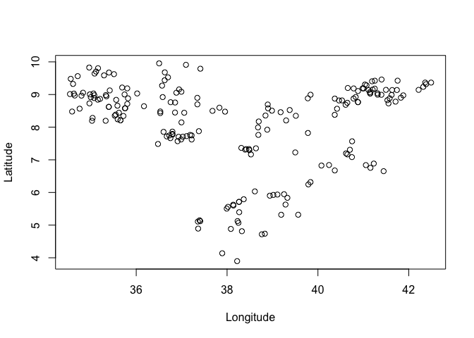
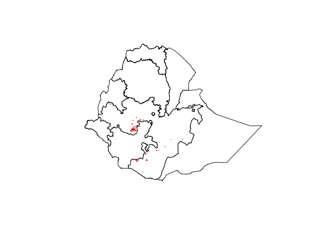
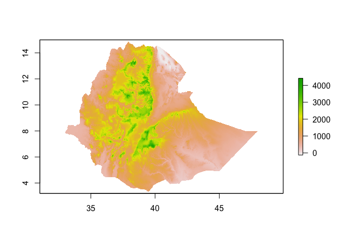

Welcome to week 1 of spatial analysis for public health. This week we
will be learning about the process of moving from visualizing spatial
data through to exploration and analysis. We will get our hands dirty
with some R code and learn how to make beautiful maps. This week's
lecture will focus on some of the concepts behind spatial epidemiology.
The code below covers loading and visualizing spatial data in R. You
will then have a chance to apply that code to new data and questions in
this week's assignment.

## Lab 1: Working with Spatial Data in R

The simplest data is a table with coordinates (i.e. point data). For
this assignment, we'll work with malaria prevalence point data from
Ethiopia. These data were downloaded from the Malaria Atlas Project data
repository and were originally collected as part of [a
study](https://link.springer.com/article/10.1186/1475-2875-10-25)
conducted in 2009.

First get the necessary libraries for this week

``` r
library(sp)
library(raster)
library(rgdal)
```

    ## Please note that rgdal will be retired by the end of 2023,
    ## plan transition to sf/stars/terra functions using GDAL and PROJ
    ## at your earliest convenience.
    ## 
    ## rgdal: version: 1.5-28, (SVN revision 1158)
    ## Geospatial Data Abstraction Library extensions to R successfully loaded
    ## Loaded GDAL runtime: GDAL 3.2.1, released 2020/12/29
    ## Path to GDAL shared files: /Users/David/Library/R/x86_64/4.1/library/rgdal/gdal
    ## GDAL binary built with GEOS: TRUE 
    ## Loaded PROJ runtime: Rel. 7.2.1, January 1st, 2021, [PJ_VERSION: 721]
    ## Path to PROJ shared files: /Users/David/Library/R/x86_64/4.1/library/rgdal/proj
    ## PROJ CDN enabled: FALSE
    ## Linking to sp version:1.4-6
    ## To mute warnings of possible GDAL/OSR exportToProj4() degradation,
    ## use options("rgdal_show_exportToProj4_warnings"="none") before loading sp or rgdal.
    ## Overwritten PROJ_LIB was /Users/David/Library/R/x86_64/4.1/library/rgdal/proj

``` r
library(leaflet)
```

Import the data

``` r
ETH_malaria_data <- read.csv("https://raw.githubusercontent.com/phw272c/phw272c.github.io/8d20c5b221b44d6f936d3aa06647bf3d13629687/course_materials/week1/Lab_files/Data/mal_data_eth_2009_no_dups.csv", header=T)
```

The columns should be self-explanatory, but briefly: \* examined =
numbers tested \* pf_pos = of those tested, how many were positive for
Plasmodium falciparum malaria \* pf_pr = Plasmodium falciparum parasite
rate which is the same as infection prevalence or proportion infected
(i.e. pf_pos / examined) \* longitude = longitude of school in decimal
degrees \* latitude = latitude of schoolin decimal degrees

``` r
# Look at the first few rows
head(ETH_malaria_data)
```

    ##    country country_id continent_id site_id          site_name latitude
    ## 1 Ethiopia        ETH       Africa    6694        Dole School   5.9014
    ## 2 Ethiopia        ETH       Africa    8017     Gongoma School   6.3175
    ## 3 Ethiopia        ETH       Africa   12873      Buriya School   7.5674
    ## 4 Ethiopia        ETH       Africa    6533       Arero School   4.7192
    ## 5 Ethiopia        ETH       Africa    4150     Gandile School   4.8930
    ## 6 Ethiopia        ETH       Africa    1369 Melka Amana School   6.2461
    ##   longitude rural_urban year_start lower_age upper_age examined pf_pos
    ## 1   38.9412     UNKNOWN       2009         4        15      220      0
    ## 2   39.8362     UNKNOWN       2009         4        15      216      0
    ## 3   40.7521     UNKNOWN       2009         4        15      127      0
    ## 4   38.7650     UNKNOWN       2009         4        15       56      0
    ## 5   37.3632     UNKNOWN       2009         4        15      219      0
    ## 6   39.7891     UNKNOWN       2009         4        15      215      1
    ##         pf_pr     method
    ## 1 0.000000000 Microscopy
    ## 2 0.000000000 Microscopy
    ## 3 0.000000000 Microscopy
    ## 4 0.000000000 Microscopy
    ## 5 0.000000000 Microscopy
    ## 6 0.004651163 Microscopy
    ##                                                                                                                                title1
    ## 1 School-based surveys of malaria in Oromia Regional State, Ethiopia: a rapid survey method for malaria in low transmission settings.
    ## 2 School-based surveys of malaria in Oromia Regional State, Ethiopia: a rapid survey method for malaria in low transmission settings.
    ## 3 School-based surveys of malaria in Oromia Regional State, Ethiopia: a rapid survey method for malaria in low transmission settings.
    ## 4 School-based surveys of malaria in Oromia Regional State, Ethiopia: a rapid survey method for malaria in low transmission settings.
    ## 5 School-based surveys of malaria in Oromia Regional State, Ethiopia: a rapid survey method for malaria in low transmission settings.
    ## 6 School-based surveys of malaria in Oromia Regional State, Ethiopia: a rapid survey method for malaria in low transmission settings.
    ##                                                                                                                                                                                                                                                                                               citation1
    ## 1 Ashton, RA, Kefyalew, T, Tesfaye, G, Pullan, RL, Yadeta, D, Reithinger, R, Kolaczinski, JH and Brooker, S (2011).  <b>School-based surveys of malaria in Oromia Regional State, Ethiopia: a rapid survey method for malaria in low transmission settings.</b> <i>Malaria Journal</i>, <b>10</b>(1):25
    ## 2 Ashton, RA, Kefyalew, T, Tesfaye, G, Pullan, RL, Yadeta, D, Reithinger, R, Kolaczinski, JH and Brooker, S (2011).  <b>School-based surveys of malaria in Oromia Regional State, Ethiopia: a rapid survey method for malaria in low transmission settings.</b> <i>Malaria Journal</i>, <b>10</b>(1):25
    ## 3 Ashton, RA, Kefyalew, T, Tesfaye, G, Pullan, RL, Yadeta, D, Reithinger, R, Kolaczinski, JH and Brooker, S (2011).  <b>School-based surveys of malaria in Oromia Regional State, Ethiopia: a rapid survey method for malaria in low transmission settings.</b> <i>Malaria Journal</i>, <b>10</b>(1):25
    ## 4 Ashton, RA, Kefyalew, T, Tesfaye, G, Pullan, RL, Yadeta, D, Reithinger, R, Kolaczinski, JH and Brooker, S (2011).  <b>School-based surveys of malaria in Oromia Regional State, Ethiopia: a rapid survey method for malaria in low transmission settings.</b> <i>Malaria Journal</i>, <b>10</b>(1):25
    ## 5 Ashton, RA, Kefyalew, T, Tesfaye, G, Pullan, RL, Yadeta, D, Reithinger, R, Kolaczinski, JH and Brooker, S (2011).  <b>School-based surveys of malaria in Oromia Regional State, Ethiopia: a rapid survey method for malaria in low transmission settings.</b> <i>Malaria Journal</i>, <b>10</b>(1):25
    ## 6 Ashton, RA, Kefyalew, T, Tesfaye, G, Pullan, RL, Yadeta, D, Reithinger, R, Kolaczinski, JH and Brooker, S (2011).  <b>School-based surveys of malaria in Oromia Regional State, Ethiopia: a rapid survey method for malaria in low transmission settings.</b> <i>Malaria Journal</i>, <b>10</b>(1):25

``` r
# Create a histogram of the prevalence
hist(ETH_malaria_data$pf_pr, breaks=20)
```


# Plotting and mapping spatial data

It is possible to use R's base graphics to plot points, treating them
like any other data with x and y coordinates. For example, to get a plot
of the points alone

``` r
plot(ETH_malaria_data$longitude, ETH_malaria_data$latitude,
     ylab = "Latitude", xlab="Longitude") #boring!
```



You might want to vary the size of the circle as a function of a
variable. For example, if we wanted to plot points with size relative to
prevalence we can use the expansion argument `cex`

``` r
# Use the cex function to plot circle size as a function of a variable. In this case prevalence. As the values are very small we can multiply by an arbitrary amount for visualization purposes
plot(ETH_malaria_data$longitude, ETH_malaria_data$latitude,
     cex = ETH_malaria_data$pf_pr * 10,
     ylab = "Latitude", xlab="Longitude")
```


## Working with 'Spatial' objects

In R, it is sometimes useful to package spatial data up into a 'Spatial'
class of object using the `sp` package. This often makes it easier to
work with and is often a requirement for other functions. The
[sp](https://cran.r-project.org/web/packages/sp/index.html) package
allows you to put your data into specific spatial objects, such as
`SpatialPoints` or `SpatialPolygons`. In addition, if your data are more
than just the geometry, i.e. if you have data associated with each
spatial feature, you can create spatial DataFrames,
i.e. `SpatialPointsDataFrames` and `SpatialPolygonsDataFrames`. For
example, if we wanted to create a SpatalPointsDataFrame using the
Ethiopia data:

``` r
ETH_malaria_data_SPDF <- SpatialPointsDataFrame(coords = ETH_malaria_data[,c("longitude", "latitude")],
                                      data = ETH_malaria_data[,c("examined", "pf_pos", "pf_pr")],
                                      proj4string = CRS("+init=epsg:4326")) # sets the projection to WGS 1984 using lat/long. Optional but good to specify

# Summary of object
ETH_malaria_data_SPDF
```

    ## class       : SpatialPointsDataFrame 
    ## features    : 203 
    ## extent      : 34.5418, 42.4915, 3.8966, 9.9551  (xmin, xmax, ymin, ymax)
    ## crs         : +proj=longlat +datum=WGS84 +no_defs 
    ## variables   : 3
    ## names       : examined, pf_pos,       pf_pr 
    ## min values  :       37,      0,           0 
    ## max values  :      221,     14, 0.127272727

``` r
# SPDFs partition data elements, e.g. the coordinates are stored separately from the data
head(ETH_malaria_data_SPDF@coords)
```

    ##      longitude latitude
    ## [1,]   38.9412   5.9014
    ## [2,]   39.8362   6.3175
    ## [3,]   40.7521   7.5674
    ## [4,]   38.7650   4.7192
    ## [5,]   37.3632   4.8930
    ## [6,]   39.7891   6.2461

``` r
head(ETH_malaria_data_SPDF@data)
```

    ##   examined pf_pos       pf_pr
    ## 1      220      0 0.000000000
    ## 2      216      0 0.000000000
    ## 3      127      0 0.000000000
    ## 4       56      0 0.000000000
    ## 5      219      0 0.000000000
    ## 6      215      1 0.004651163

``` r
# You can quickly access the data frame as per a standard data frame, e.g.
head(ETH_malaria_data_SPDF$pf_pr)
```

    ## [1] 0.000000000 0.000000000 0.000000000 0.000000000 0.000000000 0.004651163

``` r
# You can use the plot or spplot function to get quick plots
plot(ETH_malaria_data_SPDF)
```


``` r
spplot(ETH_malaria_data_SPDF, zcol = "pf_pr")
```


Let's have a look at SpatialPolygonsDataFrames. To load a polygon
shapefile (or other file types), you can use the `readOGR` function from
the `rgdal` package. For example, if you wanted to load in the province
boundaries for Ethiopia shapefile `ETH_Adm_1` from the
`ETH_Adm_1_shapefile` folder on
[GitHub](https://github.com/HughSt/HughSt.github.io/tree/master/course_materials/week1/Lab_files/Data/ETH_Adm_1_shapefile),
assuming you have downloaded the folder of files you would use the
following command

    ETH_Adm_1 <- readOGR("ETH_Adm_1_shapefile", "ETH_Adm_1")

As it happens, admin boundary data is accessible using the `getData`
function from the `raster` package. Be careful as some other packages
also have a `getData` function, so to specify that you want to use the
`getData` function from the `raster` package you can use the following
code

``` r
# You first need the ISO3 codes for the country of interest. You can access these using `ccodes()`. For Ethiopia, the ISO3 is ETH

# The getData function then allows you to retrieve the relevant admin level boundaries from GADM.
ETH_Adm_1 <- raster::getData("GADM", country="ETH", level=1) 
```

Now we can plot the point data in context

``` r
# Plot both country and data points
plot(ETH_Adm_1)
points(ETH_malaria_data$longitude, ETH_malaria_data$latitude,
     cex = ETH_malaria_data$pf_pr * 10,
     ylab = "Latitude", xlab="Longitude",
     col="red")
```



# Plotting data using web maps

Rather than just relying on R base graphics, we can easily create
webmaps using the `leaflet` package. There are many basemaps available.
See [here](https://leaflet-extras.github.io/leaflet-providers/preview/).
For any map, identify the Provider name, e.g. "OpenStreetMap.Mapnik", by
clicking on the map.

    # Define your basemap
    basemap <- leaflet() %>% addTiles()
    basemap

    # Or choose another basemap
    basemap <- leaflet() %>% addProviderTiles("Esri.WorldImagery")
    basemap

    #Let's choose a simple one
    basemap <- leaflet() %>% addProviderTiles("CartoDB.Positron")

You can use the 'piping' command %>% to add layers. As our point and
polygon data are already 'Spatial' object this is easy

    basemap %>% addPolygons(data=ETH_Adm_1)


    # to change the colors/line weight
    basemap %>% addPolygons(data=ETH_Adm_1, color = "red", 
                            weight = 1, fillOpacity = 0.2)

    #You can also add popups
    basemap %>% addPolygons(data=ETH_Adm_1, 
                            popup = ETH_Adm_1$NAME_1)

    # If you want to add points as well
    basemap %>% addPolygons(data=ETH_Adm_1, weight = 2,
                            popup = ETH_Adm_1$NAME_1) %>%
      
                addCircleMarkers(data=ETH_malaria_data_SPDF,
                                 color="red", radius = 2)

The leaflet package also has some nice functions for generate color
palettes that map to a variable you want to display. For example, if we
wanted to create a color ramp relative to prevalence we could use the
`colorQuantile` function. See ?colorQuantile for other ways to build
color palettes such as `colorNumeric`

    library(wesanderson) # for a nice color palette
    colorPal <- colorNumeric(wes_palette("Zissou1")[1:5], ETH_malaria_data_SPDF$pf_pr, n = 5)

    # colorPal is now a function you can apply to get the corresponding
    # color for a value
    colorPal(0.1)

    basemap %>% addPolygons(data=ETH_Adm_1, weight = 2, fillOpacity=0,
                            popup = ETH_Adm_1$NAME_1,
                            color = "gray") %>%
      
      addCircleMarkers(data=ETH_malaria_data_SPDF,
                       color = colorPal(ETH_malaria_data_SPDF$pf_pr), 
                       radius = 2,
                       popup = as.character(ETH_malaria_data_SPDF$pf_pr))

You might want to add a legend. This just goes on as another layer on
the map. First define the labels. In this case, we are using quintiles.

    basemap %>% addPolygons(data=ETH_Adm_1, weight = 2, fillOpacity=0,
                            popup = ETH_Adm_1$NAME_1,
                            color = "gray") %>%
      
      addCircleMarkers(data=ETH_malaria_data_SPDF,
                       color = colorPal(ETH_malaria_data_SPDF$pf_pr), 
                       radius = 2,
                       popup = as.character(ETH_malaria_data_SPDF$pf_pr)) %>%
      
      addLegend(pal = colorPal, 
                title = "Prevalence",
                values = ETH_malaria_data_SPDF$pf_pr )

For more complex popups, you can define the HTML

    basemap %>% addPolygons(data=ETH_Adm_1, weight = 2, fillOpacity=0,
                            popup = ETH_Adm_1$NAME_1,
                            color = "gray") %>%
      
      addCircleMarkers(data=ETH_malaria_data_SPDF,
                       color = colorPal(ETH_malaria_data_SPDF$pf_pr), 
                       radius = 2,
                       popup = paste("<p>","Prevalence:",
                                     round(ETH_malaria_data_SPDF$pf_pr,2),
                                     "<p>")) %>%
                                     
     addLegend(pal = colorPal, 
                title = "Prevalence",
                values = ETH_malaria_data_SPDF$pf_pr )

# Plotting raster data

If you have a local raster file (e.g. a .tif file), you can use the
`raster` command to load the file into R. For example, if you download
the
["elev_ETH.tif"](https://github.com/HughSt/HughSt.github.io/blob/master/course_materials/week1/Lab_files/Data/elev_ETH.tif?raw=true)
file from this week's data, you would use the following to load from a
local source:

    elev <- raster("elev_ETH.tif")

You can also load using a URL, e.g.

    elev <- raster("https://github.com/HughSt/HughSt.github.io/blob/master/course_materials/week1/Lab_files/Data/elev_ETH.tif?raw=true")

The `getData` functon from the `raster` package allows you to get hold
of some select raster data, such as elevation and bioclimatic layers. To
get hold of elevation for Ethiopia, use the following

``` r
elev <- raster::getData("alt", country="ETH")
elev
```

    ## class      : RasterLayer 
    ## dimensions : 1416, 1824, 2582784  (nrow, ncol, ncell)
    ## resolution : 0.008333333, 0.008333333  (x, y)
    ## extent     : 32.9, 48.1, 3.2, 15  (xmin, xmax, ymin, ymax)
    ## crs        : +proj=longlat +datum=WGS84 +no_defs 
    ## source     : ETH_msk_alt.grd 
    ## names      : ETH_msk_alt 
    ## values     : -189, 4420  (min, max)

You can plot using the plot function

``` r
plot(elev)
```



Alternatively, you can use leaflet

    basemap %>% addRasterImage(elev)

If you want to add a legend, you have to define the color palette first

    # Define palette
    raster_colorPal <- colorNumeric(topo.colors(64), values(elev), na.color = NA)

    # Plot
    basemap %>% addRasterImage(elev, color = raster_colorPal) %>%
    addLegend(values = values(elev), pal = raster_colorPal)

If you want to export the data, there are several options.

1.  Export button in the Viewer pane. Using 'Save as webpage' creates an
    html file which you can open using a browser.

2.  Save as kml for someone to open in Google Earth

```{=html}
<!-- -->
```
    library(plotKML)
    plotKML(ETH_malaria_data_SPDF) # see ?plotKML for more options

# Pop quiz

When using the base graphics to plot point data, how might you make the
points larger, but still relative to prevalence?

## Resources

The R packages
[sp](https://cran.r-project.org/web/packages/sp/index.html) and
[raster](https://cran.r-project.org/web/packages/raster/index.html) are
both important packages for spatial analysis.

R studio also have a fantastic
[site](https://rstudio.github.io/leaflet/) outlining the use of leaflet
