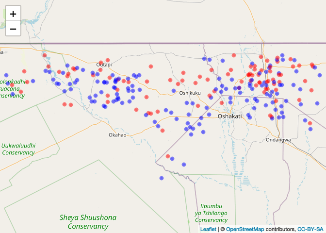
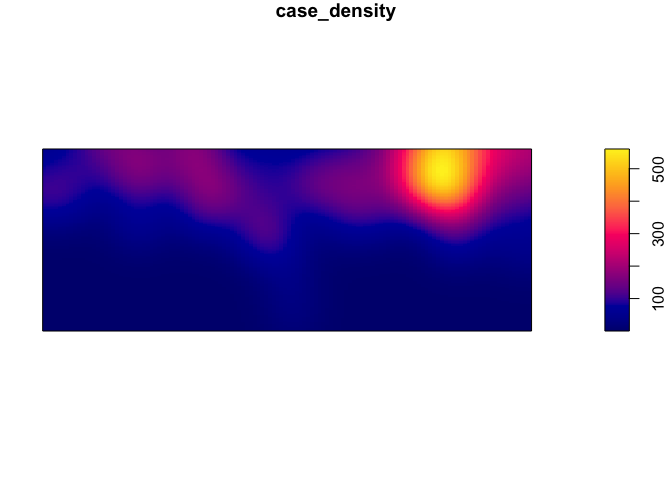
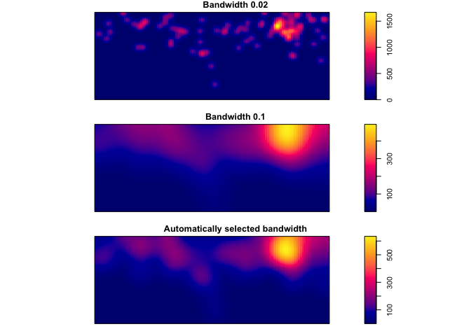
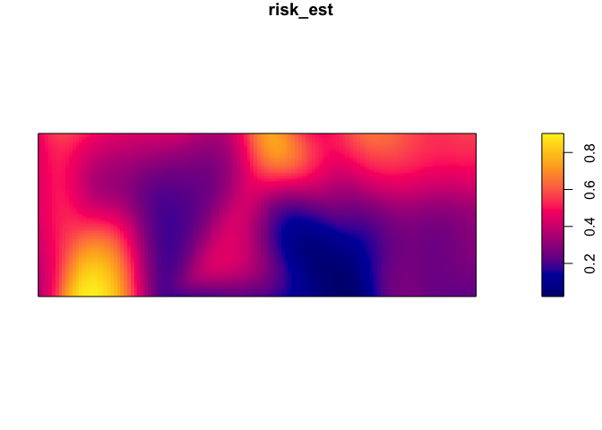
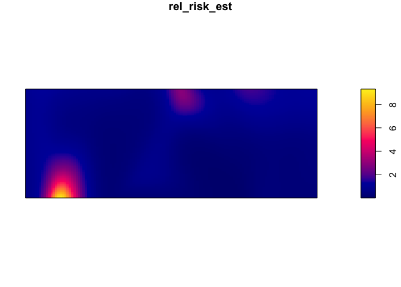
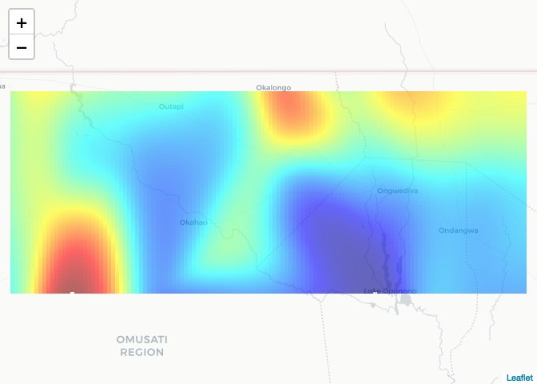
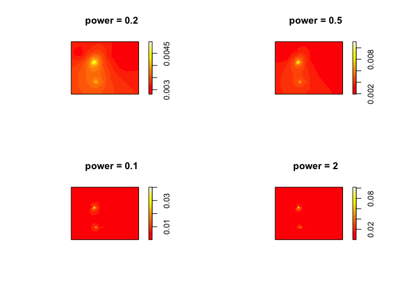
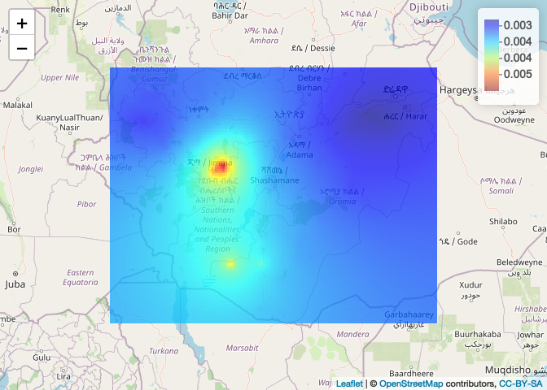
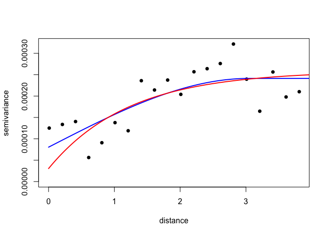
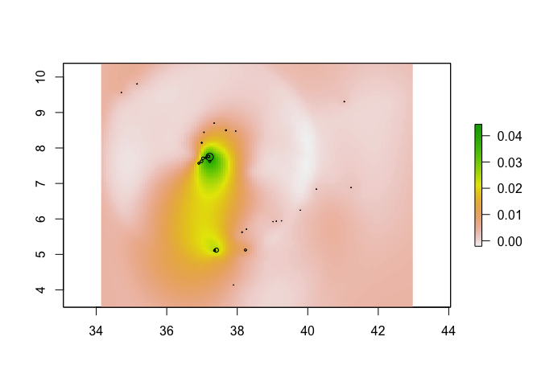

This week we are going to explore methods to understand and predict risk
across space from point data. These may be point level data
(i.e. measurements of something of interest at particular points) or
point process data (i.e. occurrences of events in a given area). When
you load this week's libraries, it may prompt you to download
[XQuartz](https://www.xquartz.org/).

``` r
library(Metrics)
library(spatstat)
library(raster)
library(sp)
library(geoR)
library(gtools)
library(lme4)
library(leaflet)
library(oro.nifti)
library(rgdal)
```

First load up some obfuscated malaria case-control data from Namibia.
This is comprised of latitudes and longitudes of cases and controls.

``` r
CaseControl<-read.csv("https://raw.githubusercontent.com/phw272c/phw272c.github.io/master/data/CaseControl.csv")
head(CaseControl)
```

    ##   household_id       lat     long case
    ## 1            1 -17.51470 16.05666    1
    ## 2            2 -17.82175 16.15147    1
    ## 3            3 -17.78743 15.93465    1
    ## 4            4 -17.51352 15.83933    1
    ## 5            5 -17.63668 15.91185    1
    ## 6            6 -17.64459 16.16105    1

To set ourselves up for further analyses, let's create objects of just
cases and just controls.

``` r
#Create a new object with just the cases, recoded as a number 1
Cases<-CaseControl[CaseControl$case==1,]

#Create a new object with just the controls, recoded as a number 0
Controls<-CaseControl[CaseControl$case==0,]
```

We are also going to create a `SpatialPointsDataFrame` of the
case-control data

``` r
CaseControl_SPDF <- SpatialPointsDataFrame(coords = CaseControl[,c("long", "lat")],
                                           data = CaseControl[,c("household_id", "case")])
```

And get hold of a boundary file for Namibia.

``` r
NAM_Adm0<-raster::getData('GADM',country='NAM',level=0)
```

Let's plot and see what we have. First, create a color scheme based on
the case classification (0 or 1).

``` r
case_color_scheme <- colorNumeric(c("blue", "red"), CaseControl_SPDF$case)
```

Then, plot

``` r
leaflet() %>% addTiles() %>% addCircleMarkers(data=CaseControl_SPDF, 
                                              color = case_color_scheme(CaseControl_SPDF$case),
                                              radius = 2)
```



## Risk Mapping using Kernel Density

To generate a kernel density estimate, we first need to generate point
pattern object of points (aka ppp). First, we need to define a window
defining the population from which the cases arose.

``` r
Nam_Owin <- owin(xrange=range(CaseControl$long),yrange=range(CaseControl$lat))
```

Now we can define the ppp object of the cases.

``` r
Cases_ppp <- ppp(Cases$long, Cases$lat, window = Nam_Owin)
plot(Cases_ppp)
```


We can now generate and plot a kernel density estimate of cases.

``` r
par(mar=c(rep(1,4)))
case_density <- density(Cases_ppp)
plot(case_density) # Units are intensity of points per unit square
```



It's possible to use different bandwidths. The larger the bandwidth, the
smoother the density estimate. You can also automatically chose a
bandwidth based on a variety of methods. Investigate `?bw.ppl` for more
information.

``` r
par(mfrow=c(3,1), mar=c(1,1,1,1))
plot(density(Cases_ppp,0.02), main = "Bandwidth 0.02")
plot(density(Cases_ppp,0.1), main = "Bandwidth 0.1")
plot(density(Cases_ppp,bw.ppl), main = "Automatically selected bandwidth") # automatic bandwidth selection based on cross-validation
```



If you want to map using leaflet, you have to convert the density object
to a rasterLayer with a coordinate reference system.

``` r
# Create raster
density_raster <- raster(density(Cases_ppp, bw.ppl))
crs(density_raster) <- crs(NAM_Adm0)

# Plot
leaflet() %>% addTiles() %>% addRasterImage(density_raster, opacity=0.6)
```


But this is just a density of cases, i.e. it doesn't account for the
denominator - the controls. To do this, we can use the Kelsall & Diggle
method (see paper in course notes), which calculates the ratio of the
density estimate of cases:controls.

First we have to add 'marks' to the points. Marks are just values
associated with each point such as case or control (1/0).

``` r
CaseControl_ppp <- ppp(CaseControl$long, CaseControl$lat, 
                       window = Nam_Owin, 
                       marks=as.factor(CaseControl$case))
```

Now we can use the `relrisk` function from the spatstat package to look
at the risk of being a case relative to the background population. In
order to obtain an output of relative risk, we must specify relative =
TRUE in the code line (the probability of being a case, relative to
probability of being a control). If the 'relative' argument is not
included in the code line the argument is technically specified as
'FALSE' since this is the default and the output is the probability of
being a case. You can set sigma (bandwidth), but the default is to use
cross-validation to find a common bandwidth to use for cases and
controls. See `?bw.relrisk` for more details.

``` r
par(mar=rep(1,4))
risk_est <-  relrisk(CaseControl_ppp) 
plot(risk_est)
```



## Obtaining a relative risk of being a case

``` r
par(mar=rep(1,4))
rel_risk_est <-  relrisk(CaseControl_ppp, relative = TRUE)
plot(rel_risk_est)
```



To plot on a web map, first specify the projection

``` r
risk_raster <- raster(risk_est)
crs(risk_raster) <- crs(NAM_Adm0)
```

Then define a color palette

``` r
pal <- colorNumeric(palette=tim.colors(64), domain=values(risk_raster), na.color = NA)
```

Then plot with leaflet

``` r
leaflet() %>% addTiles("http://{s}.basemaps.cartocdn.com/light_all/{z}/{x}/{y}.png") %>% 
  addRasterImage(risk_raster, opacity=0.6, col = pal) 
```

 `<br>`{=html} ##
Interpolation of point (prevalence etc.) data First load Ethiopia
malaria prevalence data

``` r
ETH_malaria_data <- read.csv("https://raw.githubusercontent.com/phw272c/phw272c.github.io/master/data/mal_data_eth_2009_no_dups.csv",header=T)
```

Get the Ethiopia Adm 1 level boundary file using the raster package
which provides access to GADM data

``` r
ETH_Adm_1 <- raster::getData("GADM", country="ETH", level=1)
```

### Inverse distance weighting (IDW)

Inverse distance weighting is one method of interpolation. To perform
IDW using the spatstat package, per kernel density estimates, we have to
create a ppp object with the outcome we wish to interpolate as marks. We
have to start by setting the observation window. In this case, we are
going to use the bounding box around Oromia State from which these data
were collected. To set the window for the `ppp` function, we need to use
the `owin` function.

``` r
oromia <- ETH_Adm_1[ETH_Adm_1$NAME_1=="Oromia",]
oromia_window <- owin(oromia@bbox[1,], oromia@bbox[2,])
```

Then define a ppp of the prevalence data

``` r
ETH_malaria_data_ppp<-ppp(ETH_malaria_data$longitude,ETH_malaria_data$latitude,
                         marks=ETH_malaria_data$pf_pr,window=oromia_window)
```

Set the parameters for displaying multiple plots in one screen and plot
different IDW results NB: 1) power represents the power function we want
to use 2) 'at' can be 'pixels' where it generates estimates across a
grid of pixels or 'points' where it interpolates values at every point
using leave-one-out-cross validation

``` r
par(mfrow=c(2,2))
plot(idw(ETH_malaria_data_ppp, power=0.2, at="pixels"),col=heat.colors(20), main="power = 0.2") 
plot(idw(ETH_malaria_data_ppp, power=0.5, at="pixels"),col=heat.colors(20), main="power = 0.5")
plot(idw(ETH_malaria_data_ppp, power=1, at="pixels"),col=heat.colors(20), main="power = 0.1")
plot(idw(ETH_malaria_data_ppp, power=2, at="pixels"),col=heat.colors(20), main="power = 2") 
```



To calculate the 'best' power to use, you can use cross-validation. This
is possible using the argument at=points when running the idw function.
There is no off the shelf function (that I know of) to do this, so you
have to loop through different power values and find the one that
produces the lowest error using cross-validation.

``` r
powers <- seq(0.05, 2, 0.05) 
mse_result <- NULL 
for(power in powers){CV_idw <- idw(ETH_malaria_data_ppp, power=power, at="points") 
  mse_result <- c(mse_result, mse(ETH_malaria_data_ppp$marks,CV_idw)) 
  }
```

See which produced the lowest error

``` r
optimal_power <- powers[which.min(mse_result)] 
plot(powers, mse_result) 
```

 Plot observed versus
expected with optimal power

``` r
CV_idw_opt <- idw(ETH_malaria_data_ppp, power=optimal_power, at="points") 
plot(ETH_malaria_data_ppp$marks, CV_idw_opt, xlab="Observed prevalence",
     ylab="Predicted prevalence")
```


Plot using leaflet.

``` r
# 1. Convert to a raster
ETH_malaria_data_idw_raster <- raster(idw(ETH_malaria_data_ppp, 
                                          power=0.2, at="pixels"))
crs(ETH_malaria_data_idw_raster) <- crs(ETH_Adm_1)

#2. Define a color palette
colPal <- colorNumeric(tim.colors(), ETH_malaria_data_idw_raster[], na.color = NA)

# 3. Plot
leaflet() %>% addTiles() %>% addRasterImage(ETH_malaria_data_idw_raster, col = colPal, opacity=0.7) %>%
  addLegend(pal = colPal, values = ETH_malaria_data_idw_raster[])
```

 `<br>`{=html} ##\# Kriging
We are going to use the GeoR package to perform kriging. First, we have
to create a geodata object with the package GeoR. This wants dataframe
of x,y and data

``` r
ETH_malaria_data_geo <- as.geodata(ETH_malaria_data[,c("longitude","latitude","pf_pr")])
```

We can plot a summary plot using the lowess option gives us LOWESS
curves for the relationship between x and y. LOWESS stands for locally
weighted scatterplot smoothing.

``` r
plot(ETH_malaria_data_geo, lowess=TRUE)
```


It's important to assess whether there is a first order trend in the
data before kriging. We can see from the plots of the prevalence against
the x and y coordinates that there isn't really any evidence of such a
trend. Were there to be evidence, you can add `trend = '1st'` or
`trend = '2nd'` to the plot command to see the result after having
regressed prevalence against x and y using a linear and polynomial
effect respectively.

Now generate and plot a variogram. As a rule of thumb, its a good idea
to limit variogram estimation to half the maximum interpoint distance

``` r
MaxDist <- max(dist(ETH_malaria_data[,c("longitude","latitude")]))  /2 
VarioCloud<-variog(ETH_malaria_data_geo, option="cloud", max.dist=MaxDist)
```

    ## variog: computing omnidirectional variogram

``` r
plot(VarioCloud) # all pairwise comparisons
```

 To make it easier to
interpret, we can bin points by distance. You can specify
`option = "bin"` but it's the default so we left it out.

``` r
Vario <- variog(ETH_malaria_data_geo, max.dist = MaxDist)
```

    ## variog: computing omnidirectional variogram

``` r
plot(Vario)
```


It's possible to change the way the variogram bins are constructed. Just
be careful not to have too few pairs of points in any distance class.
NB: `uvec` argument provides values to define the variogram binning
(e.g. let's try bins of 0.2 decimal degrees, about 22 km).

``` r
Vario <- variog(ETH_malaria_data_geo,max.dist=MaxDist,uvec=seq(0.01,MaxDist,0.2)) 
```

    ## variog: computing omnidirectional variogram

Let's look at the number in each bin

``` r
Vario$n
```

    ##  [1]  85 432 541 586 692 607 652 661 679 663 736 764 711 692 577 585 594 551 630
    ## [20] 724

What is the minimum? A rule of thumb is 30 in each bin

``` r
min(Vario$n)
```

    ## [1] 85

Plot

``` r
plot(Vario,pch=16)
```


We can now fit variogram model by minimized least squares using
different covariance models. In this case we are just going to use a
'spherical' and 'exponential' model.

``` r
VarioMod_sph<-variofit(Vario, cov.model = "sph")
```

    ## variofit: covariance model used is spherical 
    ## variofit: weights used: npairs 
    ## variofit: minimisation function used: optim

    ## Warning in variofit(Vario, cov.model = "sph"): initial values not provided -
    ## running the default search

    ## variofit: searching for best initial value ... selected values:
    ##               sigmasq phi    tausq kappa
    ## initial.value "0"     "3.05" "0"   "0.5"
    ## status        "est"   "est"  "est" "fix"
    ## loss value: 2.28256710551259e-05

``` r
VarioMod_exp<-variofit(Vario, cov.model = "exp")
```

    ## variofit: covariance model used is exponential 
    ## variofit: weights used: npairs 
    ## variofit: minimisation function used: optim

    ## Warning in variofit(Vario, cov.model = "exp"): initial values not provided -
    ## running the default search

    ## variofit: searching for best initial value ... selected values:
    ##               sigmasq phi    tausq kappa
    ## initial.value "0"     "1.22" "0"   "0.5"
    ## status        "est"   "est"  "est" "fix"
    ## loss value: 2.76112575299845e-05

Plot results

``` r
plot(Vario,pch=16)
lines(VarioMod_sph,col="blue",lwd=2)
lines(VarioMod_exp,col="red",lwd=2) 
```



Get summaries of the fits.

``` r
summary(VarioMod_sph)
```

    ## $pmethod
    ## [1] "WLS (weighted least squares)"
    ## 
    ## $cov.model
    ## [1] "spherical"
    ## 
    ## $spatial.component
    ##     sigmasq         phi 
    ## 0.000160867 3.048000000 
    ## 
    ## $spatial.component.extra
    ## kappa 
    ##   0.5 
    ## 
    ## $nugget.component
    ##        tausq 
    ## 8.043352e-05 
    ## 
    ## $fix.nugget
    ## [1] FALSE
    ## 
    ## $fix.kappa
    ## [1] TRUE
    ## 
    ## $practicalRange
    ## [1] 3.048
    ## 
    ## $sum.of.squares
    ##        value 
    ## 2.282567e-05 
    ## 
    ## $estimated.pars
    ##        tausq      sigmasq          phi 
    ## 8.043352e-05 1.608670e-04 3.048000e+00 
    ## 
    ## $weights
    ## [1] "npairs"
    ## 
    ## $call
    ## variofit(vario = Vario, cov.model = "sph")
    ## 
    ## attr(,"class")
    ## [1] "summary.variomodel"

``` r
summary(VarioMod_exp)
```

    ## $pmethod
    ## [1] "WLS (weighted least squares)"
    ## 
    ## $cov.model
    ## [1] "exponential"
    ## 
    ## $spatial.component
    ##      sigmasq          phi 
    ## 0.0002281533 1.2192006253 
    ## 
    ## $spatial.component.extra
    ## kappa 
    ##   0.5 
    ## 
    ## $nugget.component
    ##        tausq 
    ## 3.042044e-05 
    ## 
    ## $fix.nugget
    ## [1] FALSE
    ## 
    ## $fix.kappa
    ## [1] TRUE
    ## 
    ## $practicalRange
    ## [1] 3.652398
    ## 
    ## $sum.of.squares
    ##        value 
    ## 2.643998e-05 
    ## 
    ## $estimated.pars
    ##        tausq      sigmasq          phi 
    ## 3.042044e-05 2.281533e-04 1.219201e+00 
    ## 
    ## $weights
    ## [1] "npairs"
    ## 
    ## $call
    ## variofit(vario = Vario, cov.model = "exp")
    ## 
    ## attr(,"class")
    ## [1] "summary.variomodel"

In this case, the spherical model has a slightly lower sum of squares,
suggesting it provides a better fit to the data.

Now we have a variogram model depicting the covariance between pairs of
points as a function of distance between points, we can use it to Krig
values at prediction locations. To allow us to compare with IDW, first
get grid of points from the IDW example for comparison

``` r
# 1. Create prediction grid
IDW <- idw(ETH_malaria_data_ppp, power=0.2, at="pixels")
pred_grid_x <- rep(IDW$xcol,length(IDW$yrow))
pred_grid_y <- sort(rep(IDW$yrow,length(IDW$xcol)))
pred_grid <- cbind(pred_grid_x,pred_grid_y)

# 2. Now krig to those points
KrigPred <- krige.conv(ETH_malaria_data_geo, loc=pred_grid,
                       krige=krige.control(obj.model=VarioMod_sph))
```

    ## krige.conv: model with constant mean
    ## krige.conv: Kriging performed using global neighbourhood

Visualize predictions.

``` r
image(KrigPred,col=heat.colors(50))
```


If you want to create a raster of your predictions, you can use the
`rasterFromXYZ` function.

``` r
KrigPred_raster <- rasterFromXYZ(data.frame(x=pred_grid_x,
                                 y=pred_grid_y,
                                 z=KrigPred$predict))

plot(KrigPred_raster)
points(ETH_malaria_data[,c("longitude","latitude")],
       cex = ETH_malaria_data$pf_pr * 10)
```



Generating cross-validated predictions in straightforward in geoR using
the
[`xvlalid`](https://www.rdocumentation.org/packages/geoR/versions/1.8-1/topics/xvalid)
function. Two types of validation are possible: 1. leaving-on-out cross
validation where each data location (all or a subset) is removed in turn
and predicted using the remaining locations, for a given model. 2.
External validation which can predict to locations outside of the
dataset. Here we will use the default leave-one-out cross validation for
all points.

``` r
xvalid_result <- xvalid(ETH_malaria_data_geo, model = VarioMod_sph)
```

    ## xvalid: number of data locations       = 203
    ## xvalid: number of validation locations = 203
    ## xvalid: performing cross-validation at location ... 1, 2, 3, 4, 5, 6, 7, 8, 9, 10, 11, 12, 13, 14, 15, 16, 17, 18, 19, 20, 21, 22, 23, 24, 25, 26, 27, 28, 29, 30, 31, 32, 33, 34, 35, 36, 37, 38, 39, 40, 41, 42, 43, 44, 45, 46, 47, 48, 49, 50, 51, 52, 53, 54, 55, 56, 57, 58, 59, 60, 61, 62, 63, 64, 65, 66, 67, 68, 69, 70, 71, 72, 73, 74, 75, 76, 77, 78, 79, 80, 81, 82, 83, 84, 85, 86, 87, 88, 89, 90, 91, 92, 93, 94, 95, 96, 97, 98, 99, 100, 101, 102, 103, 104, 105, 106, 107, 108, 109, 110, 111, 112, 113, 114, 115, 116, 117, 118, 119, 120, 121, 122, 123, 124, 125, 126, 127, 128, 129, 130, 131, 132, 133, 134, 135, 136, 137, 138, 139, 140, 141, 142, 143, 144, 145, 146, 147, 148, 149, 150, 151, 152, 153, 154, 155, 156, 157, 158, 159, 160, 161, 162, 163, 164, 165, 166, 167, 168, 169, 170, 171, 172, 173, 174, 175, 176, 177, 178, 179, 180, 181, 182, 183, 184, 185, 186, 187, 188, 189, 190, 191, 192, 193, 194, 195, 196, 197, 198, 199, 200, 201, 202, 203, 
    ## xvalid: end of cross-validation

``` r
# Plot on log odds scale
plot(xvalid_result$data,xvalid_result$predicted, asp=1,
     xlab = "Observed prevalence", ylab="Cross-validated predicted prevalence")
abline(0,1)
```


You might notice that some of the kriged values are \<0. Since we are
trying to modeling probabilities this can't be true. In these
situations, it is possible to apply a transformation to your data before
kriging and then back-transform results. One transformation useful for
probabilities is the logit transform (used in logistic regression). The
`logit` and `inv.logit` functions from the package `gtools` can be used
for this. Note that it doesn't work if you have 0 values as you can't
log(0). You can add a small amount to avoid this situation. The process
would look like this.

``` r
# Add small amount to avoid zeros
ETH_malaria_data$pf_pr_adj <- ETH_malaria_data$pf_pr + 0.001

# Apply logit transform and convert to geodata
ETH_malaria_data$pf_pr_logit <- logit(ETH_malaria_data$pf_pr_adj)
ETH_malaria_data_geo_logit <- as.geodata(ETH_malaria_data[,c("longitude","latitude","pf_pr_logit")])

# Fit (spherical) variogram
Vario_logit <- variog(ETH_malaria_data_geo_logit, max.dist = MaxDist)
```

    ## variog: computing omnidirectional variogram

``` r
VarioMod_sph_logit <- variofit(Vario_logit, cov.model = "sph")
```

    ## variofit: covariance model used is spherical 
    ## variofit: weights used: npairs 
    ## variofit: minimisation function used: optim

    ## Warning in variofit(Vario_logit, cov.model = "sph"): initial values not provided
    ## - running the default search

    ## variofit: searching for best initial value ... selected values:
    ##               sigmasq phi    tausq  kappa
    ## initial.value "1.16"  "2.45" "0.15" "0.5"
    ## status        "est"   "est"  "est"  "fix"
    ## loss value: 448.598010419967

``` r
# Get CV kriged predictions
xvalid_result_logit <- xvalid(ETH_malaria_data_geo_logit, model = VarioMod_sph_logit)
```

    ## xvalid: number of data locations       = 203
    ## xvalid: number of validation locations = 203
    ## xvalid: performing cross-validation at location ... 1, 2, 3, 4, 5, 6, 7, 8, 9, 10, 11, 12, 13, 14, 15, 16, 17, 18, 19, 20, 21, 22, 23, 24, 25, 26, 27, 28, 29, 30, 31, 32, 33, 34, 35, 36, 37, 38, 39, 40, 41, 42, 43, 44, 45, 46, 47, 48, 49, 50, 51, 52, 53, 54, 55, 56, 57, 58, 59, 60, 61, 62, 63, 64, 65, 66, 67, 68, 69, 70, 71, 72, 73, 74, 75, 76, 77, 78, 79, 80, 81, 82, 83, 84, 85, 86, 87, 88, 89, 90, 91, 92, 93, 94, 95, 96, 97, 98, 99, 100, 101, 102, 103, 104, 105, 106, 107, 108, 109, 110, 111, 112, 113, 114, 115, 116, 117, 118, 119, 120, 121, 122, 123, 124, 125, 126, 127, 128, 129, 130, 131, 132, 133, 134, 135, 136, 137, 138, 139, 140, 141, 142, 143, 144, 145, 146, 147, 148, 149, 150, 151, 152, 153, 154, 155, 156, 157, 158, 159, 160, 161, 162, 163, 164, 165, 166, 167, 168, 169, 170, 171, 172, 173, 174, 175, 176, 177, 178, 179, 180, 181, 182, 183, 184, 185, 186, 187, 188, 189, 190, 191, 192, 193, 194, 195, 196, 197, 198, 199, 200, 201, 202, 203, 
    ## xvalid: end of cross-validation

``` r
xvalid_result_inv_logit <- inv.logit(xvalid_result_logit$predicted)
```

## Pop quiz

-   How could you compare how well the best fitting IDW performs versus
    kriging?
-   Which appears to be more accurate?
-   Can you visualize where predictions from IDW differ to kriging?
-   Does inclusion of a trend surface improve kriging estimates?

Answers
[here](https://raw.githubusercontent.com/phw272c/phw272c.github.io/master/code/week_3_cheat_sheet.R)

## Key readings

#### Good overview

Pfeiffer, D., T. P. Robinson, M. Stevenson, K. B. Stevens, D. J. Rogers
and A. C. Clements (2008). Spatial analysis in epidemiology, Oxford
University Press Oxford. Chapter 6.

#### Technical paper covering kernel estimation of relative risk. Key reference but not necessary to understand in detail.

Kelsall, Julia E., and Peter J. Diggle. "Kernel estimation of relative
risk." Bernoulli 1.1-2 (1995): 3-16.

#### Illustration of the Kelsall Diggle approach used to map sleeping sickness risk

[Simarro, Pere P., et al. "Estimating and mapping the population at risk
of sleeping sickness." PLoS neglected tropical diseases 6.10 (2012):
e1859.](https://journals.plos.org/plosntds/article?id=10.1371/journal.pntd.0001859)

## Additional readings

#### Nice example of kriging applied across space and time

[Gething, Peter W., et al. "A local space--time kriging approach applied
to a national outpatient malaria data set." Computers & geosciences
33.10 (2007):
1337-1350.](https://journals.plos.org/plosmedicine/article?id=10.1371/journal.pmed.0030271)

#### Additional example of Kelsall Diggle in action

Di Salvo, Francesca, et al. "Spatial variation in mortality risk for
hematological malignancies near a petrochemical refinery: A
population-based case-control study." Environmental research 140 (2015):
641-648.
