### Aim

To introduce methods for exploring clustering in spatial data

### Content

This post provides an introduction to methods for exploring clustering
in different types of spatial data. The approaches will be explored
together in R, followed by an opportunity to adapt the code and run the
analysis yourself.

### Datasets

1.  Malaria point prevalence data at the village level from Burkina Faso
2.  Leukemia data at the census tract level from New York State
3.  Malaria case event data and population controls from northern
    Namibia

First we will attach the libraries used for visualization.

``` r
library(rgdal)
library(raster)
library(ggplot2)
library(spatstat)
library(plotrix)
library(fields)
library(leaflet)
library(maptools)
library(RColorBrewer)
library(lattice)
library(geoR)
library(plotrix) 
library(car)  # contains a function for logistic transformation (log odds) to make more normal
```

These libraries are for spatial data management and point process
analysis.

``` r
library(sp)

# Moran's I and spatial dependencies
library(spdep) # Spatial Dependence: Weighting Schemes, Statistics and Models
library(ape) # Analyses of Phylogenetics and Evolution
library(pgirmess) # Data Analysis in Ecology

# Libraries for point processes
library(spatstat)
library(splancs) # K-function
library(smacpod) # Spatial scanning statistic
```

We're going to load in some malaria data from Burkina Faso and visualize
it using Leaflet to see if we can initially assess if there may be
evidence of spatial clustering. What do you think?

``` r
# Open BF malaria data
BF_malaria_data <- read.csv("https://raw.githubusercontent.com/phw272c/phw272c.github.io/master/data/BF_malaria_data.csv",header=T)
BF_Adm_1 <- raster::getData("GADM", country="BFA", level=1)
```

    ## Warning in raster::getData("GADM", country = "BFA", level = 1): getData will be removed in a future version of raster
    ## . Please use the geodata package instead

``` r
proj4string(BF_Adm_1) <- CRS('+proj=longlat +datum=WGS84 +no_defs +ellps=WGS84 +towgs84=0,0,0 ')
```

    ## Warning in proj4string(obj): CRS object has comment, which is lost in output; in tests, see
    ## https://cran.r-project.org/web/packages/sp/vignettes/CRS_warnings.html

``` r
# Calculate prevalence
BF_malaria_data$prevalence <- BF_malaria_data$positives / BF_malaria_data$examined

# What do the data look like - do you see evidence of spatial clustering?
pal = colorNumeric("Oranges", BF_malaria_data$prevalence)
leaflet(BF_malaria_data) %>% addTiles() %>% addCircleMarkers(~longitude, ~latitude, fillOpacity=1,
                                                             fillColor= ~pal(prevalence), radius=~prevalence*10, stroke=TRUE, weight=1) %>% 
  addLegend(pal = pal, values = ~prevalence)
```

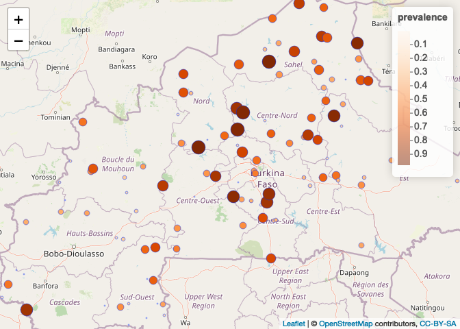

## Part I: Testing for spatial autocorrelation in point-level data

### Global spatial autocorrelation

In this section we're going to look at some more formal statistical
tests of global spatial autocorrelation. We'll look at two general ways
of doing this: using 'Moran's I' and using correlograms. These can each
be done using multiple different packages in R.

Approach 1: Calculate Moran's I using a distance based matrix

First we will look at the distribution of the prevalence data to see if
they are close to normally distributed. If the are very skewed, we will
need to transform them because the Moran's I test produces a comparison
to the normal distribution. Here, we will use the logit transformation
to produce a more normal distribution. Then we will calculate the
distance between each of the points and use the inverse of the distance
matrix to produce a matrix of weights that we will use to calculate
Moran's I.

``` r
hist(BF_malaria_data$prevalence, xlab = "Prevalence", main = "")
```

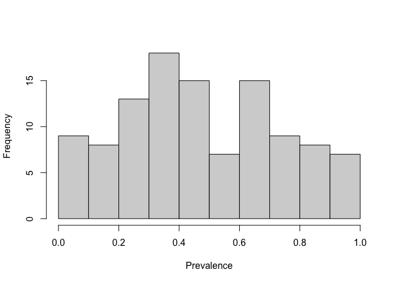

``` r
BF_malaria_data$log_odds <- logit(BF_malaria_data$prevalence)
hist(BF_malaria_data$log_odds, xlab = "Log odds", main = "")
```

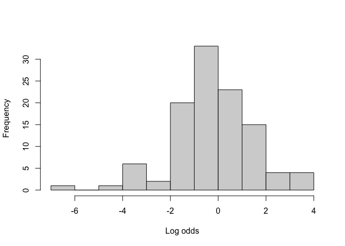

``` r
# Generate a distance matrix
BF.dists <- as.matrix(dist(cbind(BF_malaria_data$longitude, BF_malaria_data$latitude)))
dim(BF.dists) # 109 x 109 matrix of distance between all sets of points
```

    ## [1] 109 109

``` r
# Take the inverse of the matrix values so that closer values have a larger weight and vs vs
BF.dists.inv <- 1/BF.dists
diag(BF.dists.inv) <- 0   # replace the diagonal values with zero

# Computes Moran's I autocorrelation coefficient of x giving a matrix of weights (here based on distance) 
Moran.I(BF_malaria_data$log_odds, BF.dists.inv)                 # from the "ape" package
```

    ## $observed
    ## [1] 0.0666352
    ## 
    ## $expected
    ## [1] -0.009259259
    ## 
    ## $sd
    ## [1] 0.01639855
    ## 
    ## $p.value
    ## [1] 3.690017e-06

Approach 2: Create a correlogram to explore Moran's I over different
spatial lags. The "pgirmess" package requires spdep (which also has
correlogram options) but is much simplier and user-friendly.

``` r
# Calculate the maximum distance between points
maxDist<-max(dist(cbind(BF_malaria_data$longitude, BF_malaria_data$latitude)))
maxDist
```

    ## [1] 7.534414

``` r
xy=cbind(BF_malaria_data$longitude, BF_malaria_data$latitude)
pgi.cor <- correlog(coords=xy, z=BF_malaria_data$log_odds, method="Moran", nbclass=10)   # "pgirmess" package
# coords = xy cordinates, z= vector of values at each location and nbclass = the number of bins
plot(pgi.cor) # statistically significant values (p<0.05) are plotted in red
```

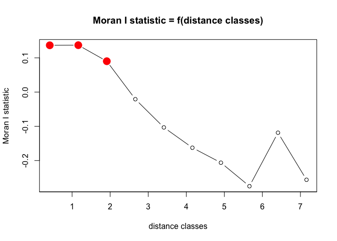

``` r
pgi.cor # distclass is midpoint for the bin
```

    ## Moran I statistic 
    ##       dist.class        coef      p.value    n
    ##  [1,]  0.4121237  0.13669304 6.435709e-04 1092
    ##  [2,]  1.1618390  0.13700359 3.059924e-06 2176
    ##  [3,]  1.9115538  0.09009855 2.482029e-05 2680
    ##  [4,]  2.6612685 -0.02082828 6.589705e-01 2172
    ##  [5,]  3.4109833 -0.10323722 9.946353e-01 1376
    ##  [6,]  4.1606981 -0.16259353 9.997622e-01 1146
    ##  [7,]  4.9104129 -0.20629178 9.991684e-01  662
    ##  [8,]  5.6601277 -0.27492632 9.990240e-01  320
    ##  [9,]  6.4098425 -0.11874035 7.536360e-01  128
    ## [10,]  7.1595572 -0.25618534 7.320096e-01   20

Based on the correlogram, over what spatial lags are there evidence for
spatial autocorrelation? Is this clustering positive or negative?

Compare the correlogram to the results from a semivariogram approach:

``` r
BF_malaria_data_geo<-as.geodata(BF_malaria_data[,c("longitude","latitude","log_odds")])

# Generate and plot a binned variogram (10 bins) NB: have made for full max distance (even though likely inaccurate) for comparison
Vario<-variog(BF_malaria_data_geo,max.dist=7.53,uvec=seq(0.4121237,7.1595572,l=10))
```

``` r
par(mfrow=c(2,1))
plot(Vario)
plot(pgi.cor)
```

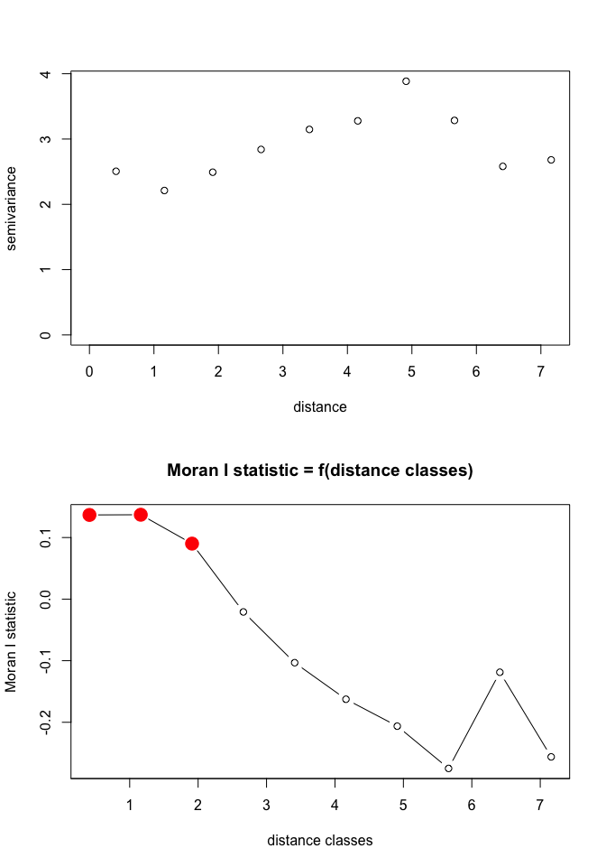

Approach 3: Calculate Moran's I using a binary distance matrix. For this
approach, we are going to create sets of 'neighbors' based upon their
proximity. This approach can be used with point data but is especially
useful for areal data, as we will see shortly.

For this approach, you will need to consider what is a sensible distance
to classify points as neighbors. Considerations might include the scale
of analysis and the distribution of points. In the comparison of
different neighboring structures, you can see that increasing the
distance within which one is considered a neighbor dramatically
increases the overall number of neighbor linkages.

``` r
coords<-coordinates(xy) # set spatial coordinates to create a spatial object
IDs<-row.names(as.data.frame(coords))

# In this approach, we chose a distance d such that pairs of points with distances less than 
# d are neighbors and those further apart are not. 

Neigh_nb<-knn2nb(knearneigh(coords, k=1, longlat = TRUE), row.names=IDs)     # using the "spdep" package
# assigns at least one neighbor to each and calculates the distances between
dsts<-unlist(nbdists(Neigh_nb,coords)) # returns the distance between nearest neighbors for each point
summary(dsts)
```

    ##    Min. 1st Qu.  Median    Mean 3rd Qu.    Max. 
    ## 0.03727 0.12693 0.19004 0.22742 0.27488 1.10524

``` r
max_1nn<-max(dsts)
max_1nn # maximum distance to provide at least one neighbor to each point
```

    ## [1] 1.10524

``` r
# We create different neighbor structures based upon distance
Neigh_kd1<-dnearneigh(coords,d1=0, d2=max_1nn, row.names=IDs)   # neighbors within maximum distance
Neigh_kd2<-dnearneigh(coords,d1=0, d2=2*max_1nn, row.names=IDs) # neighbors within 2X maximum distance

nb_1<-list(d1=Neigh_kd1, d2=Neigh_kd2) # list of neighbor structures
sapply(nb_1, function(x) is.symmetric.nb(x, verbose=F, force=T))
```

    ##   d1   d2 
    ## TRUE TRUE

``` r
# Checks for symmetry (i.e. if i is a neighbor of j, then j is a neighbor of i). Does not always hold for k-nearest neighbours
sapply(nb_1, function(x) n.comp.nb(x)$nc)
```

    ## d1 d2 
    ##  1  1

``` r
# Number of disjoint connected subgraphs

# Plot neighbors comparing the two distances 
par(mfrow=c(2,1), mar= c(1, 0, 1, 0))
plot(xy, pch=16)
plot(Neigh_kd1, coords, col="green",add=T)
plot(xy, pch=16)
plot(Neigh_kd2, coords,col="green", add=T)
```

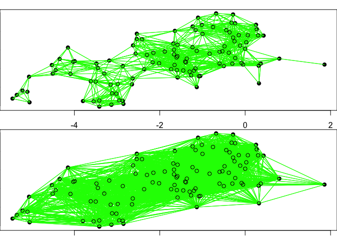

To run a spatial test for clustering, we need to assign weights to the
neighbor list. We will use the neighbor structure with all neighbors
within the maximum neighbor distance between any two points.

``` r
#assign weights; 
weights<-nb2listw(Neigh_kd1, style="W")   # row standardized binary weights, using minimum distance for one neighbor
weights                                   # "B" is simplest binary weights
```

    ## Characteristics of weights list object:
    ## Neighbour list object:
    ## Number of regions: 109 
    ## Number of nonzero links: 1914 
    ## Percentage nonzero weights: 16.10976 
    ## Average number of links: 17.55963 
    ## 
    ## Weights style: W 
    ## Weights constants summary:
    ##     n    nn  S0       S1       S2
    ## W 109 11881 109 16.44475 442.0046

Using this weights matrix, we can now run the Moran's I test on the
logit transformed prevalence using the neighborhood matrix. How do the
results compare to other approaches?

``` r
moran.test(BF_malaria_data$log_odds , listw=weights)  #using row standardised weights
```

    ## 
    ##  Moran I test under randomisation
    ## 
    ## data:  BF_malaria_data$log_odds  
    ## weights: weights    
    ## 
    ## Moran I statistic standard deviate = 4.7332, p-value = 1.105e-06
    ## alternative hypothesis: greater
    ## sample estimates:
    ## Moran I statistic       Expectation          Variance 
    ##       0.154300895      -0.009259259       0.001194126

We can also use a simulation approach: we simulate the test statistic
using random permutations of BF_malaria_data\$log_odds so that the
values are randomly assigned to locations and the statistic is computed
nsim times; we compare the observed statistic to the distribution. What
do you conclude about evidence for spatial autocorrelation?

``` r
set.seed(1234)
bperm<-moran.mc(BF_malaria_data$log_odds , listw=weights,nsim=999)
bperm
```

    ## 
    ##  Monte-Carlo simulation of Moran I
    ## 
    ## data:  BF_malaria_data$log_odds 
    ## weights: weights  
    ## number of simulations + 1: 1000 
    ## 
    ## statistic = 0.1543, observed rank = 1000, p-value = 0.001
    ## alternative hypothesis: greater

``` r
#statistic = 0.15, observed rank = 1000, p-value = 0.001

# Plot simulated test statistics
par(mfrow=c(1,1), mar= c(5, 4, 4, 2))
hist(bperm$res, freq=T, breaks=20, xlab="Simulated Moran's I")
abline(v=0.15, col="red")
```


We can now also take a look at running Moran's I for areal data
(polygons), using a dataset on leukemia from New York (Turnbull et al
1990). We will also use these data later in the course in week 7.

``` r
nydata <- rgdal::readOGR("https://github.com/phw272c/phw272c.github.io/raw/master/data/nydata.geojson")
```

    ## Warning: OGR support is provided by the sf and terra packages among others

    ## Warning: OGR support is provided by the sf and terra packages among others

    ## Warning: OGR support is provided by the sf and terra packages among others

    ## Warning: OGR support is provided by the sf and terra packages among others

    ## Warning: OGR support is provided by the sf and terra packages among others

    ## Warning: OGR support is provided by the sf and terra packages among others

    ## Warning: OGR support is provided by the sf and terra packages among others

    ## OGR data source with driver: GeoJSON 
    ## Source: "https://github.com/phw272c/phw272c.github.io/raw/master/data/nydata.geojson", layer: "nydata"
    ## with 281 features
    ## It has 17 fields

``` r
#lets take a look at the data
head(nydata@data)
```

    ##          AREANAME     AREAKEY        X        Y POP8 TRACTCAS  PROPCAS
    ## 0 Binghamton city 36007000100 4.069397 -67.3533 3540     3.08 0.000870
    ## 1 Binghamton city 36007000200 4.639371 -66.8619 3560     4.08 0.001146
    ## 2 Binghamton city 36007000300 5.709063 -66.9775 3739     1.09 0.000292
    ## 3 Binghamton city 36007000400 7.613831 -65.9958 2784     1.07 0.000384
    ## 4 Binghamton city 36007000500 7.315968 -67.3183 2571     3.06 0.001190
    ## 5 Binghamton city 36007000600 8.558753 -66.9344 2729     1.06 0.000388
    ##   PCTOWNHOME PCTAGE65P        Z  AVGIDIST PEXPOSURE   Cases       Xm       Ym
    ## 0  0.3277311 0.1466102  0.14197 0.2373852  3.167099 3.08284 4069.397 -67353.3
    ## 1  0.4268293 0.2351124  0.35555 0.2087413  3.038511 4.08331 4639.371 -66861.9
    ## 2  0.3377396 0.1380048 -0.58165 0.1708548  2.838229 1.08750 5709.063 -66977.5
    ## 3  0.4616048 0.1188937 -0.29634 0.1406045  2.643366 1.06515 7613.831 -65995.8
    ## 4  0.1924370 0.1415791  0.45689 0.1577753  2.758587 3.06017 7315.968 -67318.3
    ## 5  0.3651786 0.1410773 -0.28123 0.1726033  2.848411 1.06386 8558.753 -66934.4
    ##     Xshift  Yshift
    ## 0 423391.0 4661502
    ## 1 423961.0 4661993
    ## 2 425030.6 4661878
    ## 3 426935.4 4662859
    ## 4 426637.5 4661537
    ## 5 427880.3 4661921

For now, with this dataset we are only interested in seeing if there is
global clustering in the area-level case incidence. In the dataset we
find a 'Cases' variable that gives the estimated number of cases per
area. We need to also consider the population in each area however,
because areas with higher populations are more likely to have more cases
just due to population size. So we will first create an incidence
variable to normalize the case data by population size.

``` r
nydata$inc_per_1000 <- (nydata$Cases / nydata$POP8) * 1000
```

As these are areas and not points, we will not use distance to define
the neighbors, but rather which polygons are directly touching one
another along a boundary or boundary point.

``` r
sf::sf_use_s2(FALSE) # https://stackoverflow.com/questions/68478179/how-to-resolve-spherical-geometry-failures-when-joining-spatial-data
```

    ## Spherical geometry (s2) switched off

``` r
# Contiguity neighbors - all that share a boundary point
nydata_nb <- poly2nb(nydata)  #queen contiguity
```

    ## Warning in st_is_longlat(pl): bounding box has potentially an invalid value
    ## range for longlat data

    ## Warning in st_is_longlat(pl): bounding box has potentially an invalid value
    ## range for longlat data

    ## Warning in st_is_longlat(x): bounding box has potentially an invalid value range
    ## for longlat data

    ## although coordinates are longitude/latitude, st_intersects assumes that they are planar

``` r
nydata_nbr <- poly2nb(nydata, queen=F)  #rook contiguity
```

    ## Warning in st_is_longlat(pl): bounding box has potentially an invalid value
    ## range for longlat data

    ## Warning in st_is_longlat(pl): bounding box has potentially an invalid value
    ## range for longlat data

    ## Warning in st_is_longlat(x): bounding box has potentially an invalid value range
    ## for longlat data

    ## although coordinates are longitude/latitude, st_intersects assumes that they are planar

``` r
#coordinates
coords_ny<-coordinates(nydata)

#view and compare the neighbors
par(mfrow=c(1,2))
plot(nydata)
plot(nydata_nb,coords_ny,col="blue",add=T)
plot(nydata)
plot(nydata_nbr,coords_ny,col="green",add=T)
```

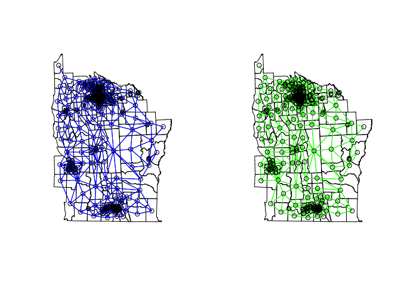

As above, we then set the weights for the neighbor matrix. The default
is row standardized (each row sums to one), or binary, where neighbors
are 1 and 0 otherwise.

``` r
##set weights - contiguity
#weights style W - row standardized
nydata_w<-nb2listw(nydata_nb)
nydata_w
```

    ## Characteristics of weights list object:
    ## Neighbour list object:
    ## Number of regions: 281 
    ## Number of nonzero links: 1624 
    ## Percentage nonzero weights: 2.056712 
    ## Average number of links: 5.779359 
    ## 
    ## Weights style: W 
    ## Weights constants summary:
    ##     n    nn  S0       S1       S2
    ## W 281 78961 281 106.6125 1164.157

``` r
#weights style B - binary
nydata_wB<-nb2listw(nydata_nb,style="B")
nydata_wB
```

    ## Characteristics of weights list object:
    ## Neighbour list object:
    ## Number of regions: 281 
    ## Number of nonzero links: 1624 
    ## Percentage nonzero weights: 2.056712 
    ## Average number of links: 5.779359 
    ## 
    ## Weights style: B 
    ## Weights constants summary:
    ##     n    nn   S0   S1    S2
    ## B 281 78961 1624 3248 41440

Based on this weights matrix, we can now do an initial check of spatial
autocorrelation in the data. What do you conclude? We will return to
this dataset in week 7.

``` r
##moran's tests of global spatial autocorrelation
moran.test(nydata$inc_per_1000,listw=nydata_w)  #using row standardized
```

    ## 
    ##  Moran I test under randomisation
    ## 
    ## data:  nydata$inc_per_1000  
    ## weights: nydata_w    
    ## 
    ## Moran I statistic standard deviate = 1.8649, p-value = 0.0311
    ## alternative hypothesis: greater
    ## sample estimates:
    ## Moran I statistic       Expectation          Variance 
    ##       0.060405798      -0.003571429       0.001176865

### Local spatial autocorrelation

The above approaches examined evidence for global spatial autorrelation.
Now we're going to look at local measures of clustering. One way to do
this is using 'Local Moran's I', which we will illustrate using the
point-level data from Burkina Faso.

``` r
# First calculate the local Moran's I around each point based on the spatial weights object (binary based on at least one neighbor)
I <-localmoran(BF_malaria_data$log_odds, weights)                         # "spdep" package

# Print 'LISA' for each point
Coef<-printCoefmat(data.frame(I[IDs,], row.names=row.names(coords),
                              check.names=FALSE))
```

    ##                 Ii        E.Ii      Var.Ii    Z.Ii Pr(z != E(Ii))    
    ##   [1,]  1.8125e-01 -7.7320e-03  2.0321e-01  0.4192      0.6750550    
    ##   [2,] -1.2819e-01 -7.9011e-04  1.6567e-02 -0.9898      0.3222658    
    ##   [3,]  1.7760e-01 -1.0791e-02  2.2400e-01  0.3980      0.6905976    
    ##   [4,]  1.6095e-01 -1.4860e-02  3.0721e-01  0.3172      0.7510925    
    ##   [5,]  1.4150e-01 -3.5181e-04  5.1692e-03  1.9730      0.0484971 *  
    ##   [6,] -9.3562e-01 -1.4721e-02  3.8417e-01 -1.4858      0.1373384    
    ##   [7,]  2.0481e-01 -3.1400e-03  3.1249e-02  1.1763      0.2394560    
    ##   [8,]  1.0326e-01 -3.9330e-04  3.9249e-03  1.6546      0.0980141 .  
    ##   [9,]  6.4866e-01 -4.1543e-02  3.9751e-01  1.0947      0.2736389    
    ##  [10,]  2.2870e-01 -3.6550e-03  4.0807e-02  1.1502      0.2500442    
    ##  [11,] -6.3207e-02 -8.4035e-04  1.7620e-02 -0.4698      0.6384687    
    ##  [12,]  5.2887e-02 -1.3459e-04  1.0018e-03  1.6752      0.0938957 .  
    ##  [13,] -3.1234e-02 -5.2641e-05  4.7285e-04 -1.4339      0.1515894    
    ##  [14,] -2.7457e-01 -3.2778e-03  2.9348e-02 -1.5836      0.1132854    
    ##  [15,]  1.8953e+00 -3.2990e-02  2.5998e-01  3.7819      0.0001556 ***
    ##  [16,]  3.7821e-01 -5.6326e-03  3.2807e-02  2.1192      0.0340724 *  
    ##  [17,] -7.7082e-02 -5.2710e-05  3.9237e-04 -3.8888      0.0001008 ***
    ##  [18,]  1.6616e-01 -2.7475e-03  1.6049e-02  1.3333      0.1824444    
    ##  [19,]  1.4622e-01 -2.3970e-03  1.6356e-02  1.1621      0.2452126    
    ##  [20,]  2.1928e-01 -4.6906e-03  2.5458e-02  1.4037      0.1603973    
    ##  [21,]  2.6115e+00 -4.3279e-02  4.6398e-01  3.8975       9.72e-05 ***
    ##  [22,]  6.0848e-01 -3.6628e-03  2.7167e-02  3.7139      0.0002041 ***
    ##  [23,]  1.4323e-01 -2.4940e-03  1.5713e-02  1.1625      0.2450275    
    ##  [24,]  2.7566e-03 -3.0994e-05  2.7841e-04  0.1671      0.8673174    
    ##  [25,] -2.7090e-01 -1.6415e-03  8.3470e-03 -2.9472      0.0032066 ** 
    ##  [26,]  2.1542e+00 -3.8421e-02  3.6883e-01  3.6104      0.0003057 ***
    ##  [27,]  1.6954e+00 -5.6051e-02  3.0991e-01  3.1460      0.0016550 ** 
    ##  [28,] -4.3038e-01 -2.1343e-03  1.3451e-02 -3.6925      0.0002221 ***
    ##  [29,] -4.5056e-01 -4.9503e-03  2.8853e-02 -2.6234      0.0087059 ** 
    ##  [30,]  2.4252e+00 -1.2102e-01  8.6691e-01  2.7346      0.0062448 ** 
    ##  [31,]  9.2584e-02 -8.5393e-05  6.9586e-04  3.5130      0.0004431 ***
    ##  [32,] -3.1174e-02 -9.1729e-03  5.7403e-02 -0.0918      0.9268343    
    ##  [33,]  6.4106e-01 -4.5588e-03  3.6983e-02  3.3572      0.0007874 ***
    ##  [34,] -1.3437e-01 -4.3284e-04  3.2208e-03 -2.3600      0.0182749 *  
    ##  [35,] -1.8818e-03 -5.0218e-06  3.1717e-05 -0.3332      0.7389483    
    ##  [36,] -5.0239e-01 -7.1528e-03  5.2867e-02 -2.1539      0.0312505 *  
    ##  [37,]  1.4153e-02 -4.8535e-05  2.1754e-04  0.9629      0.3356070    
    ##  [38,]  4.0998e-01 -3.6404e-03  3.2582e-02  2.2915      0.0219368 *  
    ##  [39,]  1.6427e-02 -5.2015e-03  7.6056e-02  0.0784      0.9374896    
    ##  [40,] -2.7545e-01 -1.2675e-03  1.1371e-02 -2.5712      0.0101353 *  
    ##  [41,] -1.2604e-01 -3.7519e-02  1.2875e-01 -0.2467      0.8051351    
    ##  [42,]  3.6265e-01 -5.1487e-02  1.8386e-01  0.9658      0.3341195    
    ##  [43,]  1.7248e-03 -1.1431e-06  3.8659e-06  0.8778      0.3800330    
    ##  [44,] -3.3785e-01 -1.1374e-02  3.8030e-02 -1.6741      0.0941034 .  
    ##  [45,]  3.0104e-01 -1.2465e-02  4.1632e-02  1.5365      0.1244130    
    ##  [46,]  6.7195e-02 -1.4421e-03  4.8702e-03  0.9835      0.3253470    
    ##  [47,]  1.4938e-01 -2.7255e-02  9.4529e-02  0.5745      0.5656223    
    ##  [48,]  4.3522e-01 -1.4718e-02  5.4593e-02  1.9257      0.0541442 .  
    ##  [49,] -1.6736e-01 -4.1614e-03  1.2665e-02 -1.4502      0.1470058    
    ##  [50,]  4.1369e-01 -3.7769e-02  1.1676e-01  1.3212      0.1864341    
    ##  [51,] -5.0223e-01 -3.4350e-02  9.2048e-02 -1.5421      0.1230389    
    ##  [52,]  3.6965e-01 -2.8057e-03  2.0828e-02  2.5808      0.0098569 ** 
    ##  [53,] -3.0961e-01 -1.0434e-02  2.8654e-02 -1.7674      0.0771670 .  
    ##  [54,] -1.4140e-02 -6.2934e-05  2.1283e-04 -0.9649      0.3345770    
    ##  [55,]  2.0417e-01 -5.6924e-03  1.5707e-02  1.6745      0.0940283 .  
    ##  [56,]  3.0584e-03 -6.8129e-05  3.2507e-04  0.1734      0.8623295    
    ##  [57,]  4.8415e-01 -4.2565e-02  1.3093e-01  1.4556      0.1454901    
    ##  [58,] -1.3320e-02 -6.0679e-04  2.0509e-03 -0.2807      0.7789243    
    ##  [59,] -1.3369e-02 -3.2063e-05  7.7571e-05 -1.5143      0.1299608    
    ##  [60,]  5.3118e-02 -5.1915e-04  1.2013e-03  1.5475      0.1217365    
    ##  [61,]  1.0467e-01 -1.0876e-03  2.5153e-03  2.1086      0.0349789 *  
    ##  [62,] -4.9491e-02 -6.3766e-03  2.2590e-02 -0.2869      0.7742217    
    ##  [63,]  7.2047e-02 -4.2040e-03  1.9976e-02  0.5395      0.5895414    
    ##  [64,] -2.1793e-01 -4.1259e-03  1.4650e-02 -1.7665      0.0773166 .  
    ##  [65,] -2.9614e-01 -1.2994e-03  9.6605e-03 -2.9998      0.0027018 ** 
    ##  [66,]  9.5520e-02 -1.4102e-02  4.9570e-02  0.4924      0.6224591    
    ##  [67,]  4.5932e-02 -1.8184e-02  5.7360e-02  0.2677      0.7889236    
    ##  [68,]  9.3542e-01 -4.6004e-02  2.2354e-01  2.0758      0.0379153 *  
    ##  [69,]  1.3055e-01 -5.0112e-03  5.5872e-02  0.5735      0.5663029    
    ##  [70,]  1.2863e-01 -2.1095e-03  6.1268e-03  1.6702      0.0948753 .  
    ##  [71,]  2.1775e-01 -1.4675e-03  1.1942e-02  2.0060      0.0448548 *  
    ##  [72,] -5.2296e-02 -1.0877e-03  5.9246e-03 -0.6653      0.5058642    
    ##  [73,] -4.2840e-02 -7.6232e-04  4.1538e-03 -0.6529      0.5138407    
    ##  [74,] -7.4349e-02 -2.2058e-04  1.5084e-03 -1.9087      0.0563044 .  
    ##  [75,]  2.4038e-03 -1.7851e-07  6.3646e-07  3.0134      0.0025836 ** 
    ##  [76,]  3.0589e-02 -1.8076e-04  4.1842e-04  1.5042      0.1325193    
    ##  [77,]  3.3824e-01 -6.9083e-03  3.2737e-02  1.9076      0.0564413 .  
    ##  [78,]  5.1673e-01 -8.2918e-03  8.2092e-02  1.8324      0.0668895 .  
    ##  [79,] -2.1323e-02 -9.0292e-04  2.3893e-03 -0.4178      0.6761299    
    ##  [80,] -3.5618e-02 -1.5616e-04  4.3329e-04 -1.7036      0.0884505 .  
    ##  [81,]  7.7589e-02 -9.7284e-03  3.2582e-02  0.4837      0.6285717    
    ##  [82,] -7.0921e-02 -2.3914e-03  8.5061e-03 -0.7430      0.4574578    
    ##  [83,]  1.3071e-01 -1.9582e-03  5.9725e-03  1.7166      0.0860512 .  
    ##  [84,] -1.2850e-02 -7.8278e-06  2.9469e-05 -2.3657      0.0179962 *  
    ##  [85,]  2.9051e-02 -5.4606e-03  2.0445e-02  0.2414      0.8092748    
    ##  [86,]  2.2357e-01 -2.4572e-03  7.8750e-03  2.5470      0.0108643 *  
    ##  [87,]  3.9491e-01 -8.9711e-03  4.2424e-02  1.9609      0.0498962 *  
    ##  [88,]  7.6021e-02 -1.7009e-03  6.7619e-03  0.9452      0.3445681    
    ##  [89,]  2.7646e-01 -1.9951e-03  1.9878e-02  1.9750      0.0482679 *  
    ##  [90,] -7.2328e-02 -3.4831e-04  1.1776e-03 -2.0975      0.0359467 *  
    ##  [91,]  1.7124e-01 -1.9620e-03  6.6226e-03  2.1284      0.0333060 *  
    ##  [92,]  2.2277e-01 -2.9446e-03  1.3159e-02  1.9676      0.0491136 *  
    ##  [93,] -1.6416e-01 -4.6451e-03  2.0724e-02 -1.1081      0.2678358    
    ##  [94,] -8.5334e-02 -2.9359e-04  1.1688e-03 -2.4875      0.0128645 *  
    ##  [95,]  1.4523e-01 -3.1646e-02  1.0926e-01  0.5351      0.5925808    
    ##  [96,]  3.4949e-02 -9.9883e-04  6.3022e-03  0.4528      0.6506747    
    ##  [97,] -3.7727e-02 -7.8684e-04  4.6053e-03 -0.5443      0.5862018    
    ##  [98,] -8.3274e-02 -3.7601e-03  1.2669e-02 -0.7064      0.4799202    
    ##  [99,] -4.5113e-02 -1.8822e-04  8.9800e-04 -1.4992      0.1338279    
    ## [100,] -5.3629e-01 -1.0667e-02  5.0357e-02 -2.3423      0.0191634 *  
    ## [101,]  4.6925e-01 -3.1158e-02  2.0648e-01  1.1013      0.2707805    
    ## [102,]  1.3653e-02 -1.0162e-05  5.9525e-05  1.7710      0.0765650 .  
    ## [103,]  1.8685e-01 -2.6668e-03  1.6798e-02  1.4622      0.1436856    
    ## [104,] -8.6863e-03 -3.2087e-05  2.8823e-04 -0.5098      0.6102264    
    ## [105,]  2.9290e-02 -1.9567e-04  6.9752e-03  0.3531      0.7240497    
    ## [106,] -2.0335e-02 -1.2801e-03  1.0419e-02 -0.1867      0.8519111    
    ## [107,]  2.5801e-01 -5.5871e-03  3.5090e-02  1.4072      0.1593723    
    ## [108,]  4.9384e-02 -2.7835e-04  4.0901e-03  0.7765      0.4374357    
    ## [109,]  6.4535e-02 -1.2828e-03  1.3965e-01  0.1761      0.8601927    
    ## ---
    ## Signif. codes:  0 '***' 0.001 '**' 0.01 '*' 0.05 '.' 0.1 ' ' 1

``` r
# Plot the spatial data against its spatially lagged values (the weighted mean of its neighbors)                         
nci<-moran.plot(BF_malaria_data$log_odds, listw=weights, 
                xlab="Log prevalence", ylab="Spatially lagged log prev", labels=T, pch=16, col="grey")
text(c(3,3, -5,-5),c(0.9, -1.9,0.9,-1.9), c("High-High", "High-Low", "Low-High", "Low-Low"), cex=0.8)
```

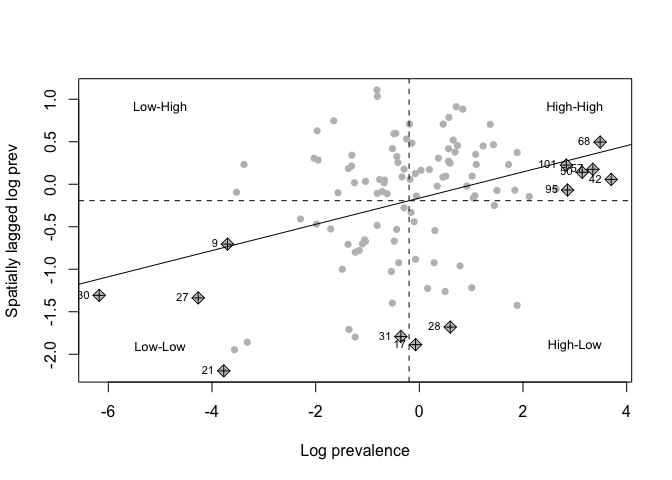

``` r
# Map points that are local outliers in the plot
infl<-nci$is_inf==T # find which points are statistically significant outliers
sum(infl==T)    #13 true (12% - more than would expect by chance)
```

    ## [1] 13

``` r
x<-BF_malaria_data$log_odds
lhx<-cut(x, breaks=c(min(x), mean(x), max(x)), labels=c("L", "H"), include.lowest=T)

wx<-lag(weights,BF_malaria_data$log_odds)
lhwx<-cut(wx, breaks=c(min(wx), mean(wx), max(wx)), labels=c("L", "H"), include.lowest=T)
lhlh<-interaction(lhx,lhwx,infl,drop=T)

names<-rep("none", length(lhlh))
names[lhlh=="L.L.TRUE"]<-"LL"
names[lhlh=="H.L.TRUE"]<-"HL"
names[lhlh=="L.H.TRUE"]<-"LH"
names[lhlh=="H.H.TRUE"]<-"HH"
```

We can map the points to show the local clusters.

``` r
BF_malaria_localM<-as.data.frame(cbind(xy,names))
colnames(BF_malaria_localM)<-c("longitude", "latitude", "names")
BF_malaria_localM[c("longitude", "latitude")] <- lapply( BF_malaria_localM[c("longitude", "latitude")], function(x) as.numeric(as.character(x)) )
factpal <- colorFactor(c( "cyan4","coral4","coral","cyan","lightgrey"), names)
leaflet(BF_malaria_localM) %>% addTiles() %>% addCircleMarkers(~longitude, ~latitude, fillOpacity=1,
                                                               color= ~factpal(names), radius=4, stroke=TRUE, weight=1) %>% 
  addLegend(pal = factpal, values = ~names, title="Class")
```

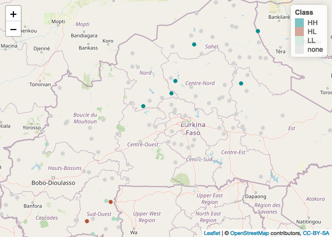

## Part II: Examining spatial point processes

In this section we're going to look at a different type of point data,
point process data, and some of the tests we can use to examine spatial
autocorrelation in these data.

First we are going to load obfuscated malaria case data from northern
Namibia.

``` r
CaseControl<-read.csv("https://raw.githubusercontent.com/phw272c/phw272c.github.io/master/data/CaseControl.csv")

#  boundary file
NAM_Adm0<-raster::getData('GADM',country='NAM',level=0)
```

    ## Warning in raster::getData("GADM", country = "NAM", level = 0): getData will be removed in a future version of raster
    ## . Please use the geodata package instead

We can convert the data to a SPDF and plot the cases and 'controls'

``` r
CaseControl_SPDF <- SpatialPointsDataFrame(coords = CaseControl[,c("long", "lat")],
                                           data = CaseControl[,c("household_id", "case")])
cases<-CaseControl_SPDF[CaseControl$case==1,]
controls<-CaseControl_SPDF[CaseControl$case==0,]

# Let's plot and see what we have
case_color_scheme <- colorNumeric(c("blue", "red"), CaseControl_SPDF$case)
leaflet() %>% addTiles() %>% addCircleMarkers(data=CaseControl_SPDF, color = case_color_scheme(CaseControl_SPDF$case),
                                              radius=3)
```

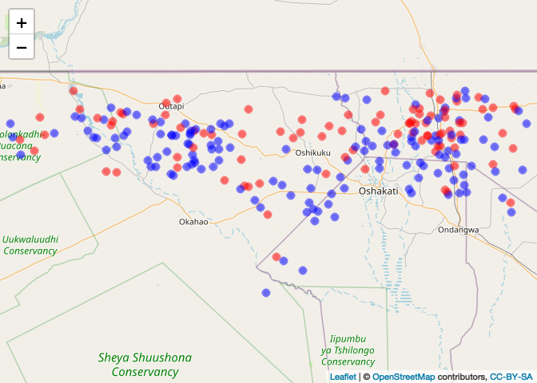

In the previous lecture, you already generated first order kernel
density estimates and calculated the ratio of the density estimate of
cases:controls. Now you will look at second order functions, summarizing
the spatial dependence between events

We need to change the case data to a PPP data type ('point pattern')

``` r
CasesPPP<-as(cases, "ppp")
```

We use Ripley's K function to summarize the spatial dependence between
events at a wide range of spatial scales

``` r
K<-Kest(CasesPPP,correction=c("isotropic", "Ripley"))    #uses the "spatstat" package

par(mfrow=c(1,1)) # Plot the estimate of K(r); note different border-corrected estimates ('iso', 'border' and 'trans')
plot(K, xlab="d (dd)", ylab="K(dd)") # Red dashed line is expected K value computed for a CRS process
```


``` r
E<-envelope(CasesPPP, Kest, nsim=999) # Plot confidence envelope using MC simulation
```

``` r
plot(E)
```


The K-function computed for cases assumes that H0 is complete spatial
randomness. What are the limitations of this assumption?

Next we can look at the difference in Ripley's K function between cases
and controls, using two approaches that do essentially the same thing;
#2 with hypothesis testing.

Approach 1: K function vignette from Bradley et al simply calculates the
K function for cases and controls, and evaluates the difference.

First create a marked point process.

``` r
CaseControlPPP<-ppp(CaseControl$long, CaseControl$lat, range(CaseControl$long), range(CaseControl$lat), marks = as.factor(CaseControl$case))

# Calculate the K-function for cases
KX <- Kest(CaseControlPPP[CaseControlPPP$marks==1],correction=c("isotropic", "Ripley"))
plot(KX, sqrt(iso/pi) ~ r)
```

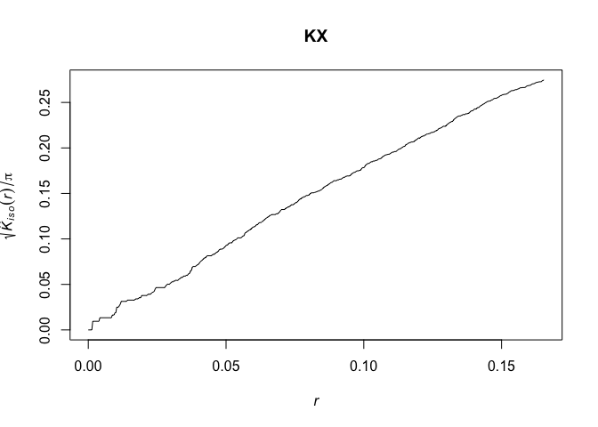

``` r
# Calculate the K-function for controls
KY <- Kest(CaseControlPPP[CaseControlPPP$marks==0],correction=c("isotropic", "Ripley"))
plot(KY, sqrt(iso/pi) ~ r)
```

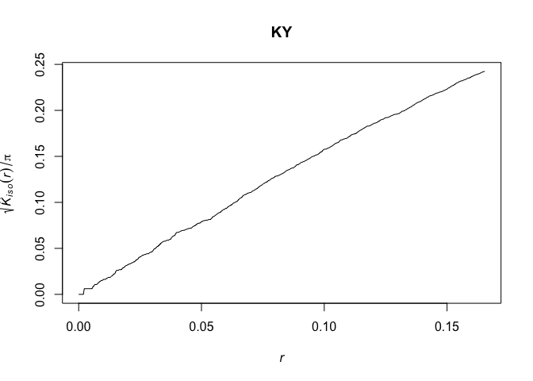

``` r
# Calulate the difference in the two functions
Kdiff <- eval.fv(KX - KY)
plot(Kdiff, legendpos="float")
```

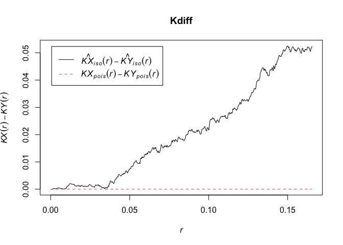

Approach 2: "Smacpod" package includes a function to estimate the
difference in K function and plot simulated CI. Also includes a function
to the test the significance based on these simulations.

``` r
kdest = kdest(CaseControlPPP, case = 2,nsim=999, level=0.95, correction=c("isotropic", "Ripley"))  #"smacpod" package
```

    ## 1 has been selected as the case group

``` r
# Note that the case = is position of the marks, not the value!  levels(CaseControlPPP$marks)
```

``` r
plot(kdest) # dark grey is min/max; light grey is confidence envelope (can change these with options)
```


``` r
kdplus.test(kdest) # Performs test of significance based on simulated confidence envelope and observed statistic
```

    ## 
    ## Diggle and Chetwynd (1991) test for difference in K functions
    ## 
    ## KD(r) = K_case(r) - K_control(r)
    ## case label:  1 
    ## control label:  0 
    ## 
    ## null hypothesis: KD(r) = 0 for all r between 0 and 0.1653646 
    ## alternative hypothesis: KD(r) > 0 for at least one r between 0 and 0.1653646 
    ## test statistic: 859.8309 
    ## p-value: 0.024 
    ## nsim: 999 
    ## simulation procedure: random labeling

## Spatial Scan Statistics

Finally we will look at spatial scan statistics using R.

On your own, you can also explore using SatScan, a free software tool
for spatial scan statistics that [you can find
here](http://www.satscan.org/).

For this exercise, we will use the "smacpod" library in R to run the
Kulldorf spatial scan statistic.

``` r
# Convert CaseControl to a "PPP" object for spatial scan
CaseControlPPP<-ppp(CaseControl$long, CaseControl$lat, range(CaseControl$long), range(CaseControl$lat), marks = as.factor(CaseControl$case))

out<-spscan.test(CaseControlPPP, nsim = 999, case = 2, maxd=.15, alpha = 0.05)    # "smacpod" library
```

    ## 1 has been selected as the case group

``` r
plot(CaseControlPPP)
```

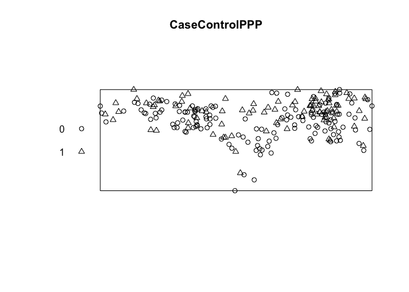

``` r
case_color_scheme <- colorNumeric(c("blue", "red"), CaseControl_SPDF$case)
leaflet() %>% addTiles() %>% addCircleMarkers(data=CaseControl_SPDF, color = case_color_scheme(CaseControl_SPDF$case), 
                                              stroke = FALSE, radius=2, fillOpacity=1)%>% 
  addCircles(lng = out$clusters[[1]]$coords[,1], lat = out$clusters[[1]]$coords[,2], weight = 2,
             radius = out$clusters[[1]]$r*112*1000, color="grey")
```


## Key Readings

Pullan, R. L., H. J. Sturrock, et al. (2012). "Spatial parasite ecology
and epidemiology: a review of methods and applications." Parasitology
139(14): 1870-1887.

Pfeiffer DU, Robinson TP, Stevenson M, Stevens KB, Rogers DJ & Clements
ACA (2008). Spatial Analysis in Epidemiology. Chapters 4 & 5. Oxford
University Press, Oxford, UK.

## Citation for the leukemia data

Turnbull, B. W. et al (1990) Monitoring for clusters of disease:
application to leukemia incidence in upstate New York American Journal
of Epidemiology, 132, 136-143

## Other good resources

Waller LA, Gotway CA (2004) Applied Spatial Statistics for Public Health
Data. John Wiley & Sons, Hoboken, New Jersey.

-   R library rsatscan can be used to run SatScan from R, see also here:
    [rsatscan](https://www.satscan.org/rsatscan/rsatscan.html)

## Selection of research applications

Bejon, P., T. N. Williams, et al. (2014). "A micro-epidemiological
analysis of febrile malaria in Coastal Kenya showing hotspots within
hotspots." Elife 3: e02130.

Brooker S, Clarke S, Njagi JK, Polack S, Mugo B, Estambale B, Muchiri E,
Magnussen P & Cox J (2004). Spatial clustering of malaria and associated
risk factors during an epidemic in a highland area of western Kenya.
Tropical Medicine and International Health 9: 757-766.

Fevre EM, Coleman PG, Odiit M, et al. (2001). The origins of a new
Trypanosoma brucei rhodesiense sleeping sickness outbreak in eastern
Uganda. Lancet 358: 625-628.

Huillard d'Aignaux J, Cousens SN, Delasnerie-Laupretre N, Brandel JP,
Salomon D, Laplanche JL, Hauw JJ & Alperovitch A (2002). Analysis of the
geographical distribution of sporadic Creutzfeldt-Jakob disease in
France between 1992 and 1998. International Journal of Epidemiology 31:
490-495.

Gaudart J, Poudiougou B, Dicko A, et al. (2006). Space-time clustering
of childhood malaria at the household level: a dynamic cohort in a Mali
village. BMC Public Health 6: 286.

Kulldorff M, Athas WF, Feuer EJ, Miller BA & Key CR (1998). Evaluating
cluster alarms: A Space-Time Scan Statistic and Brain Cancer in Los
Alamos, New Mexico. American Journal of Public Health 88, 1377-1380.

Kulldorff M & Nagarwalla N (1995). Spatial disease clusters: Detection
and inference. Statistics in Medicine 14, 799-819. Odoi A, Martin SW,
Michel P, et al. (2004). Investigation of clusters of giardiasis using
GIS and a spatial scan statistic. Int J Health Geogr 3: 11.

Mosha, J. F., H. J. Sturrock, et al. (2014). "Hot spot or not: a
comparison of spatial statistical methods to predict prospective malaria
infections." Malar J 13: 53.

Ngowi HA, Kassuku AA, Carabin H, et al. (2010). Spatial clustering of
porcine cysticercosis in Mbulu district, northern Tanzania. PLoS Negl
Trop Dis 4: e652.

Peterson I, Borrell LN, El-Sadr W, et al. (2009). A temporal-spatial
analysis of malaria transmission in Adama, Ethiopia. Am J Trop Med Hyg
81: 944-949.

Sissoko, M. S., L. L. van den Hoogen, et al. (2015). "Spatial Patterns
of Plasmodium falciparum Clinical Incidence, Asymptomatic Parasite
Carriage and Anopheles Density in Two Villages in Mali." Am J Trop Med
Hyg 93(4): 790-797.

Washington CH, Radday J, Streit TG, et al. (2004). Spatial clustering of
filarial transmission before and after a Mass Drug Administration in a
setting of low infection prevalence. Filaria J 3: 3.
