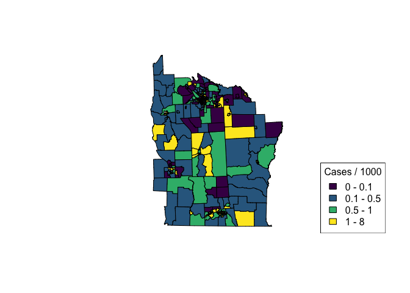
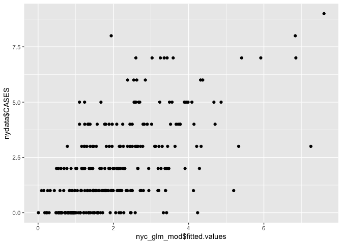
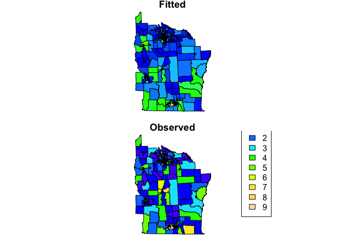
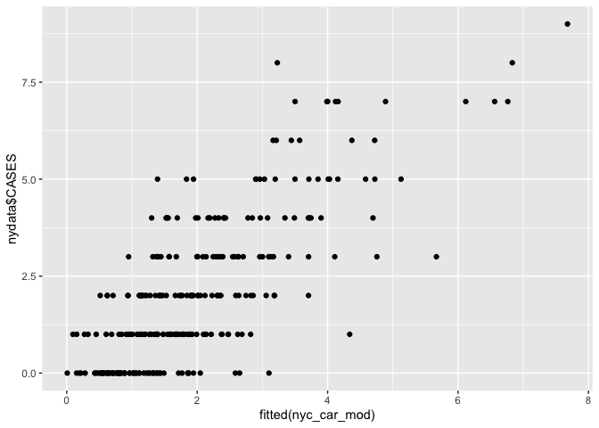
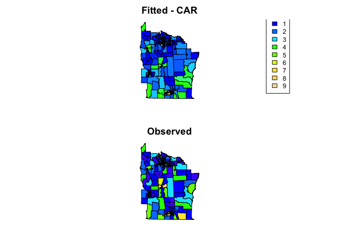

You now have the skills to:

-   map spatial data

-   obtain, generate and manipulate raster data

-   conduct spatial interpolation

-   identify clustering

-   fit spatial regression models to point prevalence data

This week are going to introduce 2 more topics.

1)  Modeling count data

2)  Fitting spatial models to areal (i.e. polygon) data

## Modeling count data

The malaria data in Oromia is an example of binomial data. You are also
likely to explore count data (e.g. numbers of disease cases). We can use
a similar process to model these data. Let's look at an example of
counts recorded over areal units (i.e. polygons). These data contain
information on leukemia cases from New York (Turnbull et al 1990). We'll
load in the shape files for New York census tracts and the locations of
hazardous waste sites as potential exposures.

First, load the libraries required for this week

``` r
library(sp)
library(ggplot2)
library(rgdal)
library(spdep)
library(leaflet)
library(spaMM)
library(viridis)
```

``` r
nydata <- rgdal::readOGR("https://github.com/phw272c/phw272c.github.io/raw/4b27bcd03f556dc666291b704e6a0f00812f51ae/data/nydata.geojson")
```

    ## Warning: OGR support is provided by the sf and terra packages among others

    ## Warning: OGR support is provided by the sf and terra packages among others

    ## Warning: OGR support is provided by the sf and terra packages among others

    ## Warning: OGR support is provided by the sf and terra packages among others

    ## Warning: OGR support is provided by the sf and terra packages among others

    ## Warning: OGR support is provided by the sf and terra packages among others

    ## Warning: OGR support is provided by the sf and terra packages among others

    ## OGR data source with driver: GeoJSON 
    ## Source: "https://github.com/phw272c/phw272c.github.io/raw/4b27bcd03f556dc666291b704e6a0f00812f51ae/data/nydata.geojson", layer: "nydata"
    ## with 281 features
    ## It has 17 fields

``` r
# Let's look at the data
head(nydata@data)
```

    ##          AREANAME     AREAKEY        X        Y POP8 TRACTCAS  PROPCAS
    ## 0 Binghamton city 36007000100 4.069397 -67.3533 3540     3.08 0.000870
    ## 1 Binghamton city 36007000200 4.639371 -66.8619 3560     4.08 0.001146
    ## 2 Binghamton city 36007000300 5.709063 -66.9775 3739     1.09 0.000292
    ## 3 Binghamton city 36007000400 7.613831 -65.9958 2784     1.07 0.000384
    ## 4 Binghamton city 36007000500 7.315968 -67.3183 2571     3.06 0.001190
    ## 5 Binghamton city 36007000600 8.558753 -66.9344 2729     1.06 0.000388
    ##   PCTOWNHOME PCTAGE65P        Z  AVGIDIST PEXPOSURE   Cases       Xm       Ym
    ## 0  0.3277311 0.1466102  0.14197 0.2373852  3.167099 3.08284 4069.397 -67353.3
    ## 1  0.4268293 0.2351124  0.35555 0.2087413  3.038511 4.08331 4639.371 -66861.9
    ## 2  0.3377396 0.1380048 -0.58165 0.1708548  2.838229 1.08750 5709.063 -66977.5
    ## 3  0.4616048 0.1188937 -0.29634 0.1406045  2.643366 1.06515 7613.831 -65995.8
    ## 4  0.1924370 0.1415791  0.45689 0.1577753  2.758587 3.06017 7315.968 -67318.3
    ## 5  0.3651786 0.1410773 -0.28123 0.1726033  2.848411 1.06386 8558.753 -66934.4
    ##     Xshift  Yshift
    ## 0 423391.0 4661502
    ## 1 423961.0 4661993
    ## 2 425030.6 4661878
    ## 3 426935.4 4662859
    ## 4 426637.5 4661537
    ## 5 427880.3 4661921

``` r
# Let's create an incidence column
nydata$inc_per_1000 <- (nydata$Cases / nydata$POP8) * 1000
cases_pal <- colorBin(viridis(4), bins = c(0, 0.1, 0.5, 1, 8), nydata$inc_per_1000)
plot(nydata, col = cases_pal(nydata$inc_per_1000), asp = 1)
legend('bottomright', legend = c('0 - 0.1', '0.1 - 0.5', '0.5 - 1', '1 - 8'),
       fill = cases_pal(c(0, 0.1, 0.5, 1, 8)),
       title = 'Cases / 1000')
```



``` r
# For more info on the dataset type ?spData::nydata
```

If we are interested in the relationship between incidence of leukemia
and proximity to hazardous waste sites, we can use a regression
framework. To model incidence, we will use a Poisson regression which is
suitable for modeling count outcomes. As we are more interested in
incidence than numbers of cases (i.e. case numbers are in part driven by
population), we can include population as an 'offset' term which
effectively allows us to model rates/incidence. Including population as
an offset is kind of like including population as a fixed effect in the
background. An offest should be included on the log scale as Poisson
regression works in log space. Sometimes, the 'expected' counts are used
in place of population. These expected counts are typically just a
scaled version of population, being the counts you would expect if the
mean incidence rate was applied to every areal unit.

Let's try fitting a simple model using the covariates `PEXPOSURE` which
is "exposure potential" calculated as the inverse distance between each
census tract centroid and the nearest TCE site.

``` r
# First round the case numbers
nydata$CASES <- round(nydata$TRACTCAS)
nyc_glm_mod <- glm(CASES ~ PEXPOSURE + PCTOWNHOME + PCTAGE65P, offset = log(POP8), 
                     data = nydata, family = 'poisson')
summary(nyc_glm_mod)
```

    ## 
    ## Call:
    ## glm(formula = CASES ~ PEXPOSURE + PCTOWNHOME + PCTAGE65P, family = "poisson", 
    ##     data = nydata, offset = log(POP8))
    ## 
    ## Deviance Residuals: 
    ##     Min       1Q   Median       3Q      Max  
    ## -2.9119  -1.1299  -0.1773   0.6448   3.2443  
    ## 
    ## Coefficients:
    ##             Estimate Std. Error z value Pr(>|z|)    
    ## (Intercept) -8.18147    0.18581 -44.033  < 2e-16 ***
    ## PEXPOSURE    0.15259    0.03166   4.819 1.44e-06 ***
    ## PCTOWNHOME  -0.35923    0.19344  -1.857   0.0633 .  
    ## PCTAGE65P    4.04964    0.60658   6.676 2.45e-11 ***
    ## ---
    ## Signif. codes:  0 '***' 0.001 '**' 0.01 '*' 0.05 '.' 0.1 ' ' 1
    ## 
    ## (Dispersion parameter for poisson family taken to be 1)
    ## 
    ##     Null deviance: 457.66  on 280  degrees of freedom
    ## Residual deviance: 382.63  on 277  degrees of freedom
    ## AIC: 957.38
    ## 
    ## Number of Fisher Scoring iterations: 5

We can see that 'PEXPOSURE' is positively related to incidence, i.e. the
further from contamination sites, the lower the risk of leukemia. We can
plot fitted versus observed values.

``` r
# Scatter plot
ggplot() + geom_point(aes(nyc_glm_mod$fitted.values, nydata$CASES))
```



``` r
# Create maps
nydata$fitted <- nyc_glm_mod$fitted.values

col_pal <- colorNumeric(topo.colors(64), c(0,9))
par(mfrow=c(2,1), mar=c(rep(0.8,4)))
plot(nydata, col = col_pal(nydata$fitted), asp=1, main = 'Fitted')
plot(nydata, col = col_pal(nydata$CASES), asp=1, main = 'Observed')
legend("bottomright", inset = 0.2,
       legend=0:9, fill = col_pal(0:9),
       title = 'Counts')
```



However, just as covered in week 6, we are making the assumption that
the model residuals are independent. In reality, often neighbouring
values display some correlation. If present, residual spatial
autocorrelation violates the assumption made when applying GLMs. In
[Week 4](../week-4) we covered how to test for spatial autocorrelation
(clustering) using a neighborhood matrix. Such an approach is suitable
for areal data where spatial relationships are often better modeled
using adjacency as opposed to distances. We can apply the same approach
using our model residuals to test for residual spatial autocorrelation
of areal data.

``` r
# Contiguity neighbors - all that share a boundary point
sf::sf_use_s2(FALSE)          #allows poly2nb to work https://stackoverflow.com/questions/68478179/how-to-resolve-spherical-geometry-failures-when-joining-spatial-data
```

    ## Spherical geometry (s2) switched off

``` r
nydata_nb <- poly2nb(nydata)  #queen contiguity
```

    ## Warning in st_is_longlat(pl): bounding box has potentially an invalid value
    ## range for longlat data

    ## Warning in st_is_longlat(pl): bounding box has potentially an invalid value
    ## range for longlat data

    ## Warning in st_is_longlat(x): bounding box has potentially an invalid value range
    ## for longlat data

    ## although coordinates are longitude/latitude, st_intersects assumes that they are planar

``` r
nydata_nb
```

    ## Neighbour list object:
    ## Number of regions: 281 
    ## Number of nonzero links: 1624 
    ## Percentage nonzero weights: 2.056712 
    ## Average number of links: 5.779359

``` r
# coordinates
coords<-coordinates(nydata)

#view the neighbors
plot(nydata, asp = 1)
plot(nydata_nb,coords,col="blue",add=T)
```


Now we have our neighbourhood list, we can run a Conditional
Autoregessive (CAR) model, which allows us to incorporate the spatial
autocorrelation between neighbours within our GLM. To do this, we are
going to stick with the `spaMM` package. We first need to convert our
neighbourhood list to a neighbourhood (adjacency) matrix which is
required by the function. For a CAR model we have to use binary weights
(i.e. are you a neighbour 0/1)

``` r
adj_matrix <- nb2mat(nydata_nb, style="B")
```

The rows and columns of adjMatrix must have names matching those of
levels of the random effect or else be ordered as increasing values of
the levels of the geographic location index specifying the spatial
random effect. In this case, our census tract ID is `AREAKEY` which is
ordered as increasing values, so we can remove the rownames of the
adjacency matrix. Alternatively, we could set
`rownames(adj_matrix) <- colnames(adj_matrix) <- nydata$AREAKEY`

``` r
row.names(adj_matrix) <- NULL
```

Now we can fit the model. The spatial effect is called using the
`adjacency` function which requires the grouping factor (i.e. the ID of
each census tract).

``` r
nyc_car_mod <- fitme(CASES ~ PEXPOSURE + PCTOWNHOME + PCTAGE65P + adjacency(1|AREAKEY) +
                             offset(log(POP8)), 
                     adjMatrix = adj_matrix,
                     data = nydata@data, family = 'poisson')
```

    ## If the 'RSpectra' package were installed, an extreme eigenvalue computation could be faster.

``` r
summary(nyc_car_mod)
```

    ## formula: CASES ~ PEXPOSURE + PCTOWNHOME + PCTAGE65P + adjacency(1 | AREAKEY) + 
    ##     offset(log(POP8))
    ## Estimation of corrPars and lambda by ML (p_v approximation of logL).
    ## Estimation of fixed effects by ML (p_v approximation of logL).
    ## Estimation of lambda by 'outer' ML, maximizing logL.
    ## family: poisson( link = log ) 
    ##  ------------ Fixed effects (beta) ------------
    ##             Estimate Cond. SE t-value
    ## (Intercept)  -8.1955  0.20389 -40.195
    ## PEXPOSURE     0.1510  0.03444   4.386
    ## PCTOWNHOME   -0.4165  0.21228  -1.962
    ## PCTAGE65P     4.0803  0.68714   5.938
    ##  --------------- Random effects ---------------
    ## Family: gaussian( link = identity ) 
    ##                    --- Correlation parameters:
    ##      1.rho 
    ## -0.2533568 
    ##            --- Variance parameters ('lambda'):
    ## lambda = var(u) for u ~ Gaussian; 
    ##    AREAKEY  :  0.06657  
    ## # of obs: 281; # of groups: AREAKEY, 281 
    ##  ------------- Likelihood values  -------------
    ##                         logLik
    ## logL       (p_v(h)): -471.4893

How has the inclusion of a spatial term affected our estimates? Remember
from week 6, that if you want to generate 95% CIs of your estimates you
can use the following code

``` r
terms <- c('PEXPOSURE', 'PCTOWNHOME', 'PCTAGE65P')
coefs <- as.data.frame(summary(nyc_car_mod)$beta_table)
```

    ## formula: CASES ~ PEXPOSURE + PCTOWNHOME + PCTAGE65P + adjacency(1 | AREAKEY) + 
    ##     offset(log(POP8))
    ## Estimation of corrPars and lambda by ML (p_v approximation of logL).
    ## Estimation of fixed effects by ML (p_v approximation of logL).
    ## Estimation of lambda by 'outer' ML, maximizing logL.
    ## family: poisson( link = log ) 
    ##  ------------ Fixed effects (beta) ------------
    ##             Estimate Cond. SE t-value
    ## (Intercept)  -8.1955  0.20389 -40.195
    ## PEXPOSURE     0.1510  0.03444   4.386
    ## PCTOWNHOME   -0.4165  0.21228  -1.962
    ## PCTAGE65P     4.0803  0.68714   5.938
    ##  --------------- Random effects ---------------
    ## Family: gaussian( link = identity ) 
    ##                    --- Correlation parameters:
    ##      1.rho 
    ## -0.2533568 
    ##            --- Variance parameters ('lambda'):
    ## lambda = var(u) for u ~ Gaussian; 
    ##    AREAKEY  :  0.06657  
    ## # of obs: 281; # of groups: AREAKEY, 281 
    ##  ------------- Likelihood values  -------------
    ##                         logLik
    ## logL       (p_v(h)): -471.4893

``` r
row <- row.names(coefs) %in% terms
lower <- coefs[row,'Estimate'] - 1.96*coefs[row, 'Cond. SE']
upper <- coefs[row,'Estimate'] + 1.96*coefs[row, 'Cond. SE']
data.frame(terms = terms,
           IRR = exp(coefs[row,'Estimate']),
           lower = exp(lower),
           upper = exp(upper))
```

    ##        terms        IRR      lower       upper
    ## 1  PEXPOSURE  1.1630502  1.0871430   1.2442575
    ## 2 PCTOWNHOME  0.6593295  0.4349178   0.9995348
    ## 3  PCTAGE65P 59.1607547 15.3859457 227.4799979

We can see how well the model fits using scatter plots and maps

``` r
# Scatter plot
ggplot() + geom_point(aes(fitted(nyc_car_mod), nydata$CASES))
```



``` r
# Create maps
nydata$fitted_car <- fitted(nyc_car_mod)

col_pal <- colorNumeric(topo.colors(64), c(0,9))
par(mfrow=c(2,1), mar=rep(2,4))
plot(nydata, col = col_pal(nydata$fitted_car), asp=1, main = 'Fitted - CAR')
legend("bottomright", inset = 0.1, cex = 0.8,
       legend=0:9, fill = col_pal(0:9),
       title = 'Counts')
plot(nydata, col = col_pal(nydata$CASES), asp=1, main = 'Observed')
```



### References

#### Citation for the leukemia data

Turnbull, B. W. et al (1990) Monitoring for clusters of disease:
application to leukemia incidence in upstate New York American Journal
of Epidemiology, 132, 136--143

#### Key reading

Bivand R, Pebesma E, Gomez-Rubio V. (2013). Applied Spatial Data
Analysis with R. Use R! Springer: New York (particularly chapter 9 on
areal data)

#### Other resources

S. Banerjee, B.P. Carlin and A.E. Gelfand (2003). Hierarchical Modeling
and Analysis for Spatial Data. Chapman & Hall.

D.J. Spiegelhalter, N.G. Best, B.P. Carlin and A. Van der Linde (2002).
Bayesian Measures of Model Complexity and Fit (with Discussion), Journal
of the Royal Statistical Society, Series B 64(4), 583-616.

L.A. Waller and C.A. Gotway (2004). Applied Spatial Statistics for
Public Health Data. Wiley & Sons.
